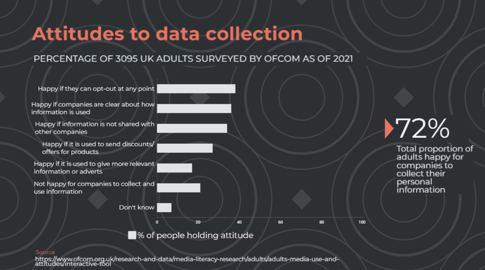

# September 2022 TPAC Meeting

The Private Advertising Technology Community Group will be meeting at TPAC in Vancouver in a hybrid format, in-person and on Zoom. 

## Schedule

### Session Start

| Time             | Day    | Location      |
| ---------------- | ------ | ------------- |
| 05:30            | 14 Wed | Tokyo         |
| 06:30            | 14 Wed | Sydney        |
| 13:30 (01:30 PM) | 13 Tue | Vancouver     |
| 16:30 (04:30 PM) | 13 Tue | Boston        |
| 21:00 (09:30 PM) | 13 Tue | London        |
| 22:00 (10:30 PM) | 13 Tue | Brussels      |

## Joining Information

Zoom: https://us02web.zoom.us/j/2442125179?pwd=bUEzK3c4Ykl5Zk1ZNHYxeTdvcFU2Zz09

## Agenda

- == 30m: Intro
  - 15m: Review our progress and path forward
  - 15m: Status update - introduce yourself and briefly let us know what you think about measurement proposals.
- => 1hr: Progressing Towards Measurement Technical Specification MVP 
- <= 15m: Progression on WG
- <= 15m: Discuss progression on Threat Model

## Minutes

Minutes Document: https://docs.google.com/document/d/1dur1soZtHAsAB_xIoD7SrJtRuvUWjz3ElUxVXUsV6c8/edit?usp=sharing

## Private Advertising Technology Community Group Minutes - 202209 TPAC Meeting

#### Read All about It!

[https://github.com/patcg/meetings/blob/main/2022/09/13-tpac/W3C%20Read%20All%20About%20It!.pdf](https://github.com/patcg/meetings/blob/main/2022/09/13-tpac/W3C%20Read%20All%20About%20It!.pdf)

### == 30m: Intro

#### 15m: Review our progress and path forward

* CG Documents
    * [Private Ad Technologies Principles](https://patcg.github.io/docs-and-reports/principles/)
    * [Threat Model](https://github.com/patcg/docs-and-reports/blob/main/threat-model/Threat-Model-Draft-2022-08-09.md)
* [WG Charter](https://patcg.github.io/patwg-charter/charter.html)
    * Quick note on WG chartering progress
    * Ask your ACs to Vote 
    * Noting the existence of a public Formal Objection, you can review here: [https://bit.ly/3U5ea33](https://bit.ly/3U5ea33) 

[https://bit.ly/3U5ea33](https://bit.ly/3U5ea33) (tracking-free link [https://gist.github.com/AramZS/4cff9da5ec95f03468ad872a63bc75a3](https://gist.github.com/AramZS/4cff9da5ec95f03468ad872a63bc75a3))

**Aram and Sean T:** Introductions. Quick review of progress thus far

Talked through private tech principles, when previously discussed, it will come out of the work we did, so will amend as time goes on. If we have time we will discuss the threat model. Thanks to Erik T for this. Highly recommend reviewing it

Submitted the WG charter to W3C to move it forward in process. May not get to this in this meeting so will cover quickly - charter is moving forward. Ask AC reps to vote for or against it or however you feel about it. **PLEASE VOTE. **

There is an existing formal objection levied against the WG charter, documented publicly on email/post. I have put it in the appropriate markdown and you can read it yourself. W3C proper must deal with it first so we won’t be discussing, but giving you a heads up. W3C will review and come back with suggestions for changes to the WG charter to resolve. 

For today, we are too many to introduce, so will simply note that it is nice to see folks in person. That is it for intros. Last thing to do in the first 30m today is to review where people are thinking on existing mmt proposals. Our next agenda item will be progressing toward tech spec, so good time to give a heads up on your thoughts, what you’d like to see included, if there’s anything we should have in that discussion we may not automatically think of.

#### 15m: Status update - introduce yourself and briefly let us know what you think about measurement proposals.

Before we get to that, talk to us about your thoughts/feelings on measurement proposals. You can queue on the GDoc. Convention is also to recognise hands

**John Wilander:** Asked by so many people at TPAC about our thoughts, would like to share. Also note I’m the editor of PCM which we hope to bring here. Position in a more general sense is that it is important for these things, we don’t want to end up in the same place as cross site tracking. We think it is important to build and ship explainable things to users. This is hard because the tech is mind boggling. We strive for simplicity in PCM for this reason. We realize that some of the proposals here with server side or MPC processing may have to rely on “ground trust”. That needs to be recognised that there’s an element to explain to users of “trust us” we’ve picked some “good players”. We do see that there are differing views, some parts of the world focus on reducing privacy harm, and if you reduce that harm you can live up to legal requirements or privacy goals. The other perspective is “rights” where users may have rights to not have data used for purposes, even if harms are reduced. Next is that we are striving to design something on by default in browsers, which makes it important to land right here - we don’t want to do a ton of work and then it is off by default. We need to recognise in this work that we are going for a second order user benefit - most users would not say yes to MPC for ad measurement. Our argument is that thriving websites would result - and we need to bet on users wanting that. Finally, there may be a point where maybe we have to have public commitments from trackers that they will no longer attempt to track if they get to use this technology.

**Ben Savage:** I resonate with a lot of what John said. He’s right that we have to try for on by default, user benefit is indirect. The characteristics of the world I think we want to create is where the future of browsing history is private. People want to use apps and websites, this will only happen if interop is possible. We need to have a future with not constant consent popups. We want a whole bunch of characteristics where people can benefit from the web. We are taking baby steps though, let’s take aggregate measurement - this isn’t everything, and we likely don’t have all of the things we need in one step. It is an important first step though, and I would love to see us make some progress and agree on something. I would like to think there is common ground, minimal set of standards that we can agree on for aggregate measurement and there should be some baked in way of doing this that is supported by default by platforms. Will it be enough to remove the financial incentive of tracking on its own? Probably not - but I think if we can do that then we can start to look to future problems.

**Charlie Harrison:** Editor of Attribution Reporting API (ARA). Want to respond to John also. Largely agree with 80-90% of what you said. Want to cut in some nuance - second order effects are exactly right - this is a feature for developers to build ecosystems that end up being good for users. And in order for us to succeed, it requires a level of utility and usefulness in the APIs - this is a challenging balancing act, but the bad case scenario is that we spend all of the effort but instead of disabling it, nobody uses it, and we have to go back to the drawing board. I’m concerned about this process of failure where we build, nobody uses, and repeat. We want to have an eye on utility to make sure these things will be used. The second is around user understandability - lots of nuance here I think - sometimes comes into conflict with true privacy, and is what we’ve seen of some of the criticism with PCM, it has a beautiful privacy model with a few edge cases and holes that are problematic. We need to balance the true privacy that we are rigorous in defending, with user understandability, and should be comfortable with compromising here to ensure we’re catering to real privacy when building these APIs. Other than that, agree on most of what you said.

**Nick Doty:** Appreciate the chance to talk about our general thoughts. It’s great to start with a comprehensibility question. I’ve raised this in a few meetings. Threat model doc is one way to do this. Other considerations for explainability, transparency and control, comprehensibility, sustainability… I’ve been working on a doc for this. Necessary to get ongoing willingness to participate - may be different from other questions like consent. Very aware that asking complex or meaningless questions is not useful, but believe that for users to be active and willing, we need to consider this.

**Aram:** Think that the doc you have is valuable to work on - we’re going to add this to our group and discuss and incorporate in our next meeting.

**Martin Thomson:** Appreciate John’s points as I don’t have to repeat them. Most important is participation that Charlie talked about. To some extent I think Charlie talked about explainability, but I think it is also important that advertisers are able to operate their business in a profitable fashion. It’s also important that users are engaging with “default on”. I don’t think we get anywhere near the utility that ads business needs without doing this. Unfortunately this means that the privacy has to be really strong to do this - something weak or exploitable won’t have the assurances that users expect from us. I’d like to have a formal definition amongst ourselves, but also have a more abstract comprehensible explainer of how we’re operating here. For browsers, this is our contract with our users, and if we can’t get there we won’t be able to participate either.

**Brian May:** User comprehensibility - a lot of what happens on the internet users don’t comprehend. They do trust people who do comprehend though - so less about that but more about people who are experts who believe this is privacy preserving and people trust those experts. The other is on promises from public companies - I’d like to see whatever solution we develop to include enough auditing and visibility so that when companies give promises there is a means of validating that they are keeping their promises.

**Erik T:** Picking good players and trusting that - agree there’s responsibility here, but it’s also not just about that. We should build as “trust-less” as possible so that we don’t need to fully trust those players.

**Graham Mudd:** Building on utility a bit - believe it’s important that if there isn’t utility there, and the ad ecosystem won’t support it. A concerning recent example is clean rooms which are claimed to be private. We are seeing this as a result as the “next best alternative” but what concerns me is all of the marketing around it that makes it believed to be private. Concerned that this becomes the de-rigeur approach unless legislation or otherwise prevents it. Doesn’t feel like privacy but seems like many believe it is.

**Ben Savage:** Comprehensibility - I think the most important thing we can explain to people is the trust model - what does this offer to them in terms of guarantees? If X and Y and Z happen, and still nobody knows what your browser history is - I think this is comprehensible around what the guarantee is that you get. The inner working - agree with Brian, people will ask people they trust. If all of those people say they agree, then that is a pretty good thing. Good metaphors - I don’t know how an airbag works, I have a general model for it, that if I am in a car crash, the airbag will work. Or rebar - I have general trust that the gov of Canada have put in some kinds of laws and there are rules around how much rebar is used so that the building is sound in an earthquake and we aren’t all going to die. I don’t need to see signs or details or spray material for all of this, but I have confidence that rebar is there to protect my safety. I think this is similar - the important thing to know is what do you get and how well does it protect you?

**John W:** I like the airbag comparison in general but would argue that users would like an airbag if asked. This is not one of those though.

James Rosewell links - [Ofcom data says the public is tech savvy – so why does big tech rely on patronising policies? – Movement For An Open Web](https://movementforanopenweb.com/ofcom-data-says-the-public-is-tech-savvy-so-why-does-big-tech-rely-on-patronising-policies/) | [Review of literature relevant to data protection harms (ico.org.uk)](https://ico.org.uk/media/about-the-ico/documents/4020142/plum-review-of-literature-relevant-to-data-protection-harms-v1-202203.pdf)

**James R:** Put a couple of links into the document that I think you’ll find interesting - one OFCOM research in the UK surveying public ties, users’ views and perception of digital and how it affects them ([link](https://movementforanopenweb.com/ofcom-data-says-the-public-is-tech-savvy-so-why-does-big-tech-rely-on-patronising-policies/).) Would be nice to frame using that justification using perhaps less “concrete” examples. The other I will add in a minute from ICO in the UK with an agency called Plum [that summarizes a number of documents](https://ico.org.uk/media/about-the-ico/documents/4020142/plum-review-of-literature-relevant-to-data-protection-harms-v1-202203.pdf). Most relevant is that 72% of adults surveyed are happy for companies to collect their personal information

**Aram:** Want to agree with some of the things said so far, do think we are if not already on the edge of a Napster-style situation, where if we do not provide a degrading solution, but reasonable alternative that gives us the privacy that we and some users seem to want, hearing disagreement from James, then there is a risk that people will continue to try to route around it. I have confidence we can provide an alternative and that we can build something here to present to the community as an alternative that is much simpler than the terribly complicated thing you will have to do otherwise. This leads us right into the question of progressing to MVP.

**Aram:** Sorry that we haven’t got longer - due to our inexperience as chairs. Next time we will give you the many many hours you desire.

**Erik :** Can we propose a meeting that is not one year away at TPAC?

**Aram:** Yes. TPAC has unblocked some COVID concerns - we have a process and experience. IETF published an interesting paper preventing COVID spread. Another meeting is desirable and possible.

**Sean T:** Have to make sure that whoever offers up the site has space for 50+ people.

**Erik:** I think we can figure it out

**Charlie:** We can schedule breakouts for tomorrow too. Would we be happy to extend the time? 

**Aram + W3C:** Too much already. We will meet remotely in October and do more things soon.

### => 1hr: Progressing Towards Measurement Technical Specification MVP

**Aram:** Now have representatives from all major browser vendors. Important to start progressing MVP version of the tech spec for measurement. How this will work is that specs start as drafts outside of working groups, they are refined in a CG like we have here, and then progressed when they are ready to become the “living recommendation” doc as the final step. We are going to progress to doing this. It is a standard way of doing it. Hopefully this answers questions about that

**Sean T:** Part of what we have baked in is input from external stakeholders. That doesn’t mean we’ll wait forever for input but we have a mechanism for this. It is in the charter.

**Aram:** We have had a bunch of folks that work with external organizations talking during TPAC about these orgs wanting to be more involved, so hopefully we will get more input from them. We are a CG so anyone can participate if they sign the appropriate commitments without payment. We encourage others to send reps and get involved.

First step in moving forward to MVP is to find volunteers who will work as editors. Editors will lead the process, won’t be the only ones who will write it. Opening up the floor for this conversation, note it is an MVP not final spec, open for much discussion, we are just progressing forward. Will open the queue to questions or to folks who would like to be involved to volunteer.

**Brian May:** First q- how do we arrive at the definition of MVP? Looking at the attribution API from chrome, there’s two APIs - event and aggregate. That looks like a good model to me. Event is quick to get learning from, aggregate has more on the backend.

**Charlie:** Will volunteer as an editor. Similar concern to Brian - premature to start to work on a spec when we have 3/4/5 proposals floating around and everyone has a different idea about what the output of PATCG should be. Don’t know if there’s a process for narrowing down what we work on. We’ve been talking around it for the last year or so, but have to make a decision on the direction we’re going towards.

**Aram:** I think that the answer of how we resolve it is we collected a lot of data, and have info needed to make the decision, the way we make it is starting to author specification. Consensus based org, so the answer is others and yourself will start to write a spec and define a decision, which will be discussed/objected among the group in a way we can resolve it. Otherwise concern is we’ll continue to discuss without a path forward. 

**Charlie:** So to be concrete, we will have volunteers who will be editors, who separate from this group will produce an artifact to present to this group for conversation

**Aram:** Yes

**Brian:** May be wise to start by saying this is what we want in MVP, and at least get the majority of people to agree it’s a good MVP. Doing spec before that doesn’t make sense.

**Aram:** Don’t expect the Oct meeting to have this figured out, but we will start lightweight, get feedback, no other specs on our plate right now. An early draft that starts as an outline with basics, and coming to us for feedback is what I expect from the editors.

**Brian:** What is the process

**Aram:** First draft will come to this group for feedback and will exist in github as a doc. 

**Brian:** Suggest everyone get an email to link to the doc when it is there. 

**Aram:** We will open an issue and will send it out to everyone automatically via github.

**Brian:** Should open an issue and send an email. With a **RED ARROW**

**Erik T:** Happy to contribute to this. Want to say that a productive first step is to highlight the areas where different existing proposals differ because I think it will be easier to discuss those decision areas rather than trying to make them, but bringing them back to the group would be a good first step.

**Martin T:** Stick me in the volunteer queue. I think until we resolve some of the major issues, giving the task of producing a doc is not going to work, because those decisions have effects on the entire proposal. We need to have concrete decisions on things like attribution happening on device or outside, aggregated or not? Vehemently oppose anything based on the event API because the privacy properties I care about and think our users care about can’t be met there. Some debate about MPC or TEE, but guidance on that point would be useful. Fundamental things to fix, and not necessarily have consensus, but general sense that this direction is right is what we need to say something meaningful and not “Charlie was here”.

**Aram:** Looking like the group looks for something less than an outline but more a set of decisions from which we can move to an outline.

**Erik, Martin, Charlie, Brian:** +1 to that 

Mariana; Can volunteer as editor, remember last time MVP functionally we discussed 2-3 options and then getting feedback from potential users of API rather than soliciting feedback from users in general. From privacy POV, browsers here should draw their redlines about what they are willing to do. Intersection may be narrow after we do that. This would include attribution questions, acceptable technologies, and more.

**Aram:** Would be great to get someone from all of the major browsers on there. Sean mentioned previously there’s a process in the charter for getting feedback, this would be subject to that. Going to web advertising BG and talking to them would probably fill their next upcoming meeting slot. Does that answer your question?

**Mariana:** Yes

**Erik Anderson:** When we’re talking about starting the spec, or speclike things, is there a layering or composability that enables us to not ignore different outcomes or perspectives of browsers on utility/threat model tradeoffs, what happens on device, off device, etc. Would be nice to figure out if there are some pieces we can make super concrete but not necessarily combine in the one uber doc that everyone signs off up front. Alternatively can do the redlines as Mariana suggested, are we only going to do that? Let’s not ignore the places we can agree.

**Aram:** I agree. This is something that can go into that initial document and we need to understand what people are willing to implement.

**Martin Thomson:** Curious as to Erik’s redlines. John and I are forthright about this. Google have been open about what they’re willing to do. Haven’t heard as much from Microsoft. What do you have to say on that point?

**Erik A:** Certainly agree - TEE discussion worth highlighting, we’re looking at that and at IPA, questions around reasonable computation costs, we want solutions that meet a high privacy bar but are also useable and get the right utility. Maybe wishy-washy at this point and want to keep doing more research around that. Certainly don’t want to enable cross site tracking, spend time and energy and have something completely broken from a privacy perspective.

**Martin:** Because of no clear articulations on what the privacy redlines are has made this hard. Knowing what they are, maybe not today, but soon, is what I’d like to see. I understand it is hard on the spot. Another thing is that extending this discussion out to cover a few more proposals is not what I’m looking for at this point. I get the sense that most understand the shape of the offerings. Want a concrete sense from the people in this room, not just Erik A, on preferences and what options are most appealing to them. I hope we can get more concrete today - rare opportunity.

**Mariana:** Don't want to wait for more proposals - want to highlight key differences. 

**Martin:** Now is a good time.

**Charlie:** Can respond to Martin - but first want to support what Erik T was saying before - if we can produce tentative decisions, of redlines but also yellow lines where we can agree to disagree. To answer Martin’s question - I think at least from where I’m coming from, I have concerns about computation cost - orders of magnitude more data processing on certain solutions is an issue. Want to maximize privacy/utility frontier; for a given privacy level that we like, want to make sure it is the most useful possible. In some cases PCM or ondevice privacy I don’t think will cut it. Would like to build a platform where we can extend and innovate on and add features over time with more bells and whistles. 

**Ben Savage:** I like to speak directly. I think we have an idea - thank you Erik A for talking about layers and how browsers can do slightly different things. One thing I have observed - two APIs - setMatchKey and getEncrypedMatchKey. If a browser vendor decides they are not comfortable, for reasons like explainability - if that presents a problem, there’s a simple degradation where you just don’t support setMatchKey. Rather than having keys set by anyone, you can just randomly generate at device level. You can potentially do app>app, web>app, app>web, etc, but in the confines of one device. Lets unify on a set of APIs, don’t have to have every single browser shipping the same thing. Architecturally this has the capability of working cross devices and having this being explainable. Other thing - getEncryptedMatchKey is bound to some semi/weakly trusted server side infra. Can only be used there, things are constrained to there. If we are unable to align on the privacy budget, let's imagine one browser says one unit and another says two units. We could possibly say  when you generate the match key, it conforms to the appropriate privacy budget that applies. Maybe some browsers generate a second privacy budget. Maybe interop on basic aggregation, but there may also be other use cases that can be supported. Layering can give us common structure for the API and maybe this is bound to specific constrained infra.

**Sean Bedford:** wanted to talk about stakeholders. If we want to go to broad, we’ll get bogged down. I’d prefer as an output, what are the minimal building blocks that starts to take us in the directions that will meet the needs of some of those stakeholders. We know that there are some key stakeholders, but we know what each need are different things. What we want to try to do is not lock us into a specific set of needs and blocking others. 

**Mariana:** My point was not to go an ask people what they need, but rather evaluate the options. I want to avoid something so narrow that no one uses it. 

**Sean Bedford:** I share that concern, we need to speak to people to understand that. It’s also ok to have a gap and be aware of it. At the moment we have a multiplication upon multiplication with too much complexity to start.

John Wilander on 

1. Per-device vs cross-device, We are leaning toward per-device. Could be optional, where other browsers support cross-device.
2. Include in the threat model of server processing: Compromised (hacked), Curious (going rogue), or Compelled (law enforcement request etc). The IPA proposal includes this. We try to think through these three cases when servers are involved.
3. Include the global perspective, including trusted computing across the globe. We are one of the few that have lots of users in China. What is ok differs, especially with trusted computing. This is something we would like to be sure we pay attention to. 
4. The risk with server dependencies in web standards. It may become very hard for new players to enter the market [because of potential cost or paying operational fees]. Are these APIs and the servers a requirement for becoming a compliant browser?
5. Ease of adoption for developers as a goal to not benefit big players.
6. Websites should not know if the user has the feature on or off to avoid nudging.

**Graham Mudd:** Maybe this is a good time to think about what are the dimensions where we want to understand the yellow and red lines, particularly from the browsers. That would be a useful step forward.

**Don:** Interested in acceptance by users. To what extent this has been subjected to user research. Is this the kind of processing users will accept? Are there good results that could be shared in such a way that it can help people understand what would be understood by end users.

Aram Zucker-Scharff (brief chair’s privilege question):  It would be great if someone with more W3C experience could address a larger part of Don’s question. Are there any specifics of doing user research? Are there other examples we can look at?

**Charlie:** Just wanted to quickly respond to point 4, risk of server dependency. I sympathize to this point, but I don’t know if, most of the proposals that have been floated don’t require the browser vendor to spin up a server. A new browser would be able to use a similar list of semi-trusted parties.

**John W:** It would be great to specify if you offer this service, you need to offer it to all browsers.

Alex Cone (could we list the sum total of use cases enabled by the proposal on the table? I presume draft MVP isn’t going to get beyond that.): I can’t imagine theres anyone who wouldn’t want to make money by working with all browsers.

By now, if we look at the use cases between IPA, ARA, PCM, you can see what’s probably possible. I would propose doing that instead of spinning on use cases.

**Erik Taubeneck:** I was going to make the same point as Charlie.  With IPA we want to shift the cost onto the users of the API and not the web platform vendors.  This is critical that the costs are aligned with the users of the resource.

**Ben Savage:** Something we’ve thought a lot about, whatever we design, how does it effect the ecosystem and what are the effects we want to see on the ecosystem. What we’d like to see is a measurement API that tends towards accuracy / telling the truth. A really key incentive is who’s most aligned with learning that result: the advertiser. What we’d like to do, and pushed for a design where attribution happens server side, is because it puts the choice of which attribution heuristic to use on the advertiser. Having it on device can lead to a conflict of interest.

**Charlie:** Pile on to Alex’s point about use cases, since we are fixated on MVP. I think we have a good list of broad use cases, and for the proposals, we should outline what we think is possible in the non-MVP proposal. IPA is very simplistic in what it proposes now, but has a lot of extensibility in a couple years, and I think that’s an important factor. Maybe a table of what use cases are potentially supported by what proposal would be good. 

**Aram:** Agree that steel manning is important. Should consider MVP as a base that we’d extend from, that’s why MVPs exist. Having more information in the initial draft, but also whatever we can get in in terms of red lines / yellow lines will be important to get into by the next meeting. I would like to make sure we progress and have items to discuss in the next meeting. 

Other thing I wanted to mention is in terms of server side operation. The other piece of the Napster problem: without a solution people are going in directions that are not great for the publisher or ad tech or users. Server side is becoming more of a necessity the longer that goes on. We can have a long argument about how much users trust their browsers and which they trust most, but other participants have continually been saying they trust processing in the browser less and less. Lots of feedback that they want to move things off the browser. Whether that is justified, if they don’t trust that using it is safe for their business, they won’t use it. I think some component of it will need to operate server side.

**John W:** Does everyone but browsers have that?

**Aram:** I’m sure browser vendors trust themselves, and probably users. Ad tech, publishers, trade groups, don’t trust the browsers.

**Martin:** I’m not sure we trust ourselves. There’s a question as to if we can run sophisticated code in the browser, and the reason ARA moved to declarative is because we don’t trust running arbitrary code. We just don’t trust ourselves with browsing history.

**Brian May:** Want to add to what Martin said. It’s good if the browser doesn’t take on the responsibility of measurement.

**Aram:** Queue is empty. 8 people have volunteered to be an editor. Give folks their desired process.

**Sean:** It will be an open process, don’t worry if your name isn’t on there.

**Aram:** To be clear, we intend to have documents come back frequently.

**Charlie:** I agree with what has been said, to Alex’s point about comparing the different proposals, steelman merrits. Red / yellow / green lines, where we are willing to stand, and producing a document where we have not a path forward, but alignment / agree to disagree. In the best case scenario there is a path forward, needs technical validation, in the worst case, the intersection is null.

**Erik Taubeneck:** I agree with Charlie. The most important thing we could do first is identify what dimensions the proposals differ on.  There are a lot of similarities. We can then work through differences.

**Ben Savage:** I want to lean into what Erik A said earlier. We should try to make an inelegant mash-up hybrid.  Trying.

**Martin:** Same. I think probably the best thing to start off with is a taxonomy of what is viable. We don’t yet have the list of things that are possible [edit: by which I mean, what the concrete proposals are]. Then can draw lines though: this is unacceptable or this is a must have. I’m willing to try the Chimera thing but in practice may be really really hard.

**Graham:** +1. Only additional thing is how we evaluate utility. It’s use case dependent, but we need to know how to evaluate it.

**Thomas Prieur:** From Criteo. Want to bring use cases. We can make expectations around what we are trying to do, waht we’d like to support.

**Paul deGrandis:** I’m going to let the browser folks hammer it out. I’m here to represent large retail media/DOOH groups who want to work with (mostly) 1st party data, as well as an organization who may want to be processing the events, and what would be required for reporting.

**Brian May:** I just want to get a relatively straight forward statement of what the MVP will do, inputs, outputs, and what use cases it will cover.

**Mariana Raykova:** There is a generalized statement, and each proposal is an instantiation of the statement. Maybe each browser has their own instantiation. Should also dig deeper on the security side. Cannot think about security and privacy independently. Unclear if privacy is better on device or off device.

**Brain May:** Wanted to follow up, it would be good after the MVP outline, coming up with the items for debate and not debate them there, but highlight them.

**Sean:** We have half the browser vendors represented. It would be great if the other browser vendors could make it very clear what their red lines are so we don’t have to do this twice.

**Aram:** Process question. Should we open a new repo? Keep it in docs-and-reports? 

**Erik/Martin:** Put it in _private-measurement _existing repo. Can we also create a slack channel?

**Aram/Sam:** Yes, we’ll do it in the W3C community slack. #private-ad-technology-cg

**Martin:** Are we going to talk about on-device/off-device.

**Charlie:** Should we try to get red lines?

**Graham:** Or at least the dimensions.

**Erik A:** +1 to dimensions.

**SLACK INFO:** 

**Join the W3C Community Slack to access:** 
* PATCG async channel - #private-advertising-technology-cg
* PATCG measurement editors - #private-advertising-technology-measurement-editors

**Erik T:**

* We've heard on-device / off-device dimension — where attribution happens
* How privacy is afforded to users: making sure outputs apply to more than one person, making outputs differentially private so that even after cross-referencing outputs it still can't apply to a single person
* How aggregate computation happens: MPC vs TEE, what that server-side processing looks like, how we make it as minimal trust as possible, get practicality comfortable with it

**Other editors, assorted:**

* Domain of aggregation — how many "buckets" we are aggregating to
* Source of event and conversion data.  Does it need to come from browser, or can it come from off-device
* Same-device vs cross-device
* Stance on third parties, delegation, sharing of budget
* Are we doing attribution across all parties or across just different subsets of them?
* Privacy definitions: encompasses domain size, different parties. Not aligned, key question

**John Wilander:** My list of 6 was an attempt to provide answers to this information.  I do recognize that there is per-device (vs cross-device) and on-device vs off-device, those are different.  Also want to mention, as I said earlier, commitments not to track — promise form API users.  This could go all the way to an allow-list of API callers.

**Graham Mudd:**  Agreed.  People will use this API, and double-dip, using other stuff also.  Can't be OK

**Erik: Also dimension of interoperability:** Certainly browsers might make choices differently from one another.  Want to make that possible, but want the base level to be interop, make it work as well as possible.

**Brian:** Could we have a protocol like HTTP that provides the data in a consistent way, so that anyone who can provide data from one player can understand from all?

**Charlie:** Which events are acceptable inputs to the API?  Like PCM only allows clicks, ARA allows both clicks and views.

**Brian:** Since we're talking about cross-browser compatibility, should we allow "I won't let you record data on my browser if you also record it on other browser whose policy stance I don't like?"  I.e. servers that only accept things from some browser and not others?

**Martin:** That sounds like failure to me

**Aram:** Sounds like a bad outcome

**Ben:** Privacy budgeting — what is the granularity?  IPA vs ARA differ on this.  If you're an attacker and attempting to use this API, what is the max information you can gain? — reasonable way to approach.

**Sean:** If off-device, who is operating the servers, and where are the servers, geographically located from a regulatory etc pov.

**Erik:** We also need to consider user experience so we aren’t filling up people’s storage or failing on user experience we don’t want to end up like mining cryptocurrency (this is a hyperbolic example) in terms of impact on their device. 

**Graham:** What is the right time to think about always-on vs consent-based?  Proposal first and then browsers decide whether they would have it on by default?

**Martin:** no, pick that first, want that decided ahead of time.  If we don't have that on by default for most users, then we've lost.  Bad for utility, both from coverage and from skew-ness of sample.

**Charlie:** That's important, and it's not just on-or-off.  Maybe some browser vendors think cross-device should be disabled by default, for example.  May not be just a boolean decision

**Aram:** We don't want to pop up a consent screen, we agree those are bad.  But want browsers or developers to be able to turn off the thing, or parts of the thing.

**Martin:** The big ML question!  What preferences are / tolerances are for enabling the use case "Learn ML model from aggregate data" — is it mandatory, OK happening later, not OK happening at all.

**Charlie:** And is that different from the desired privacy definition?  If we have a privacy def that allows ML, but we don't want to allow it, maybe our definition is wrong.

**Thomas Prieur:** What are the privacy concerts that the user raised?

**Aram:** A process for user studies is needed. State of documentation varies a lot; anyone can cherrypick whatever answer they want from existing literature.  Need some filtering mechanism for literature review.

**Don:** Browser vendors have their internal work about this, but often is confidential, because it includes info on customers or upcoming features.  If there's a way to go back to some existing user research within browser developer organizations, sanitize it to remove stuff that can't be made public, that would be incredibly helpful

**Erik:** For October meeting, could we have a document that outlines these dimensions?  Maybe redlines, but at least crystalize the dimensions?

**Mariana:** Would be great if the browsers have answers.

**Sean:** We have a meeting in 6 weeks, maybe have people review stuff in the last 2 weeks, so maybe 4 weeks from now have dimensions?

**Aram:** Any iteration would be useful, even if it doesn't cover the whole thing

**Martin:** Would be interested to hear what folks like Nick Doty (who isnt' here any more) have to say on the topic

**Brian:** Should we be considering input events requirements at this point?

**Charlie:** Yes, good to discuss, click vs click-and-view difference right now.

**Paul: Regarding ML:** We have a dedicated group for privacy preserving ML specifically for ad decision engines.  We do it with 0-party data, 1-party data, sometimes privacy model is very weak, etc.  Sometimes in whitepapers that are confidential, but I'll pull out whatever I can, to get some of the voice captured on how it happens in reality.

**Last 5-ish minutes:** Next meeting

**Aram:** THank you to all participants, both in person and remote.  Serious progress in a good direction.  Looking forward to seeing all these documents.  There is a #slack channel now, come see me later if you can't enter it.  Next meeting is in 6ish weeks, October.  Time will be bad for at least one time zone, don't remember who right now, sorry in advance.

**Sean:** Going to try to pigeonhole people for a Spring-ish meeting in person somewhere, maybe Jan or Feb.

**Aram:** Great document of other privacy events going on this week: [https://docs.google.com/document/d/1Iq7i2Rb9MPVddrt3AgHZlpt6ttLY7QenJLkbFqlHqMc/edit?pli=1](https://docs.google.com/document/d/1Iq7i2Rb9MPVddrt3AgHZlpt6ttLY7QenJLkbFqlHqMc/edit?pli=1)

Hope your TPAC goes well.

**Sean:** Get your AC Rep to vote on the WG Charter!
### VOLUNTEERS (aka willing victims):

1. Charlie Harrison
2. Erik Taubeneck / Ben Savage (backup for Erik when out on leave)
3. Martin Thomson
4. Graham Mudd
5. Thomas Prieur
6. Paul deGrandis
7. Brian May
8. Mariana Raykova

### &lt;= 15m: Progression on WG

### &lt;= 15m: Discuss progression on Threat Model

## Participants

1. Sean Turner (sn3rd - co-chair)
2. Aram Zucker-Scharff (The Washington Post - co-chair)
3. Mariana Raykova (Google)
4. Erik Anderson (Microsoft Edge)
5. Ben Savage (Meta)
6. Graham Mudd (Anonym)
7. Charlie Harrison (Google Chrome)
8. Garrett Johnson (Boston University)
9. Alex Cone (IAB Tech Lab) 
10. Risako Hamano (Yahoo Japan)
11. Lionel Basdevant (Criteo)
12. Jay Kishigami (W3C)
13. Kyle Hogan (MIT)
14. Sean Bedford (Meta)
15. Paul deGrandis (Kevel)
16. Don Marti (CafeMedia)
17. Aloïs Bissuel (Criteo)
18. Elias Selman (Criteo)
19. Erik Taubeneck (Meta)
20. Siddharth Sharma (Microsoft)
21. Sam Weiler (W3C/MIT)
22. Mike O’Neill (Baycloud)
23. Alex Turner (Google Chrome)
24. Rachit Sharma (IAB TL)
25. Martin Thomson (Mozilla)
26. Dominic Cooney (Meta)
27. James Aylett (Omnicom / Annalect)
28. Thomas Prieur (Criteo)
29. Theodore Olsauskas-Warren (Google)
30. Cornelius Witt (eyeo)
31. Richa Jain (Meta)
32. Sid Sahoo (Google Chrome)
33. Heng Tang(LinkedIn)
34. Russell Stringham (Adobe)
35. John Wilander (Apple WebKit)
36. James Rosewell (51Degrees 1st ½ hour only)
37. Maria Mandlis (Google)
38. Arthur Sonzogni (Google)
39. Camille Lamy (Google=
40. Yifan Luo (Google Chrome)
41. Nick Doty (Center for Democracy & Technology)
42. Joshua Ssengonzi(W3C/Article 19)
43. Sergey Tumakha (Microsoft Ads)
44. Don Le (ARTICLE 19)
45. Daniel Masny (Meta)
46. Josh Karlin (Google Chrome) 
47. Jonathan Hao (Google Chrome)
48. Michael Kleber (Google Chrome)
49. Laszlo Gombos (Samsung)
50. Brian May (dstillery)
51. Tim Geoghegan (ISRG)
52. Joel Pfeiffer (MSFT)
53. John Douglas (WeTransfer)
54. Wendell Baker (Yahoo)
55. Lisa Markou (Ford)
56. Julien Delhommeau (Xandr)
57. Andrew Comminos (Meta)
58. Phillipp Schoppmann (Google)
59. Sam Weiss (Meta)
60. Max Gendler (News Corp)
61. David Dworken (Google)
62. Kristina Yasuda (Microsoft)
63. Daniel Rojas (Google Chrome)
64. Taiki Yamaguchi (Meta)
65. Christine Runnegar (PING co-chair)
66. Amandeep Aggarwal (Amazon)
67. Brandon Maslen (Microsoft Edge)

## IRC Log

**martinthomson** changed the topic to **PATCG @ W3C TPAC | Zoom: [https://us02web.zoom.us/j/2442125179?pwd=bUEzK3c4Ykl5Zk1ZNHYxeTdvcFU2Zz09](https://us02web.zoom.us/j/2442125179?pwd=bUEzK3c4Ykl5Zk1ZNHYxeTdvcFU2Zz09) | Minutes: [https://docs.google.com/document/d/1dur1soZtHAsAB_xIoD7SrJtRuvUWjz3ElUxVXUsV6c8/edit#heading=h.wb33rxh6i6rv](https://docs.google.com/document/d/1dur1soZtHAsAB_xIoD7SrJtRuvUWjz3ElUxVXUsV6c8/edit#heading=h.wb33rxh6i6rv) |**

[13:56:40] <martinthomson> I think that the comprehensibility of TLS is a great example of how something very complex can be understood very simply.

[13:56:51] <martinthomson> We have a chance of doing the same thing here.

[13:57:48] <dmarti> I'm still having trouble understanding the default on/default off choice...can users be asked the 1st time and then not be bothered again?

[13:58:19] <martinthomson> Clean rooms don't really meet the bar for us.  We appreciate that it can achieve privacy goals, but we don't see them as being strong enough to satisfy our privacy concerns.

[13:58:37] <martinthomson> That goes to Erik T's point about trust.

[13:59:23]  **drojas** (~drojas@11c9e7f5.public.cloak) joined the channel

[13:59:36] <kyle_hogan> what is a "clean room" in this context?

[13:59:55] <pdegrandis> fwiw, I don't think the larger retail media companies believe data cleans are long-term viable (and some flat out aren't going to pursue them)

[14:00:14] <pdegrandis> data clean rooms**

[14:00:33]  **lgombos_** (~lgombos@11c9e7f5.public.cloak) joined the channel

[14:00:33] weiler are there rules against yelling "earthquake" in a tall building?

[14:02:12] <eriktaubeneck> to the airbag metaphor, you may very well find people who are quite willing to pay less for a car without an air bag if it were an option

[14:03:20] <grahammudd> A clean room a mechanism for aggregating and computing on data in which the parties sharing data agree to the types of queries/computation can take place.  They generally support protecting company's data sharing interests (keeping their data safe) but do not generally provide any privacy guarantee.

[14:03:23] <grahammudd> [https://digiday.com/marketing/data-clean-room/](https://digiday.com/marketing/data-clean-room/)

[14:03:28]  **alexmt** (~alexmt@11c9e7f5.public.cloak) joined the channel

[14:04:02] <kyle_hogan> @grahammudd thanks! very helpful

[14:04:13] <dmarti> [https://yougov.co.uk/topics/consumer/articles-reports/2018/03/26/targeting-personalised-ads-right-audience](https://yougov.co.uk/topics/consumer/articles-reports/2018/03/26/targeting-personalised-ads-right-audience)

[14:04:48] <dmarti> there is no one set of preferences or norms held by all users...different people see it differently

[14:05:38] <martinthomson> "Cisco (2020) surveyed 2,600 adults in 12 countries about data privacy concerns. The survey found that 29% of respondents were “privacy actives” and had switched companies or providers over data protection concerns."

[14:05:57] <pdegrandis> Strong support for doing another in-person meeting

[14:06:01]  **mav** (~mav@11c9e7f5.public.cloak) left IRC (Ping timeout: 180 seconds)

[14:06:03] <martinthomson> That shows that there are fewer than 72% of people who are willing to have their information exploited - at least in that survey.

[14:06:16] <martinthomson> Not sure where the 72% figure comes from then.

[14:06:32]  **lisamarkou_** (~lisamarkou@11c9e7f5.public.cloak) left IRC (Ping timeout: 180 seconds)

[14:07:06] <martinthomson> "The latest survey of 2,102 adults found that 77% of respondents say protecting their personal information is essential"

[14:07:07] <jaylett> Comfort can change depending on how well people understand what "sharing with other companies means", eg Coopamootoo et al 2022.

[14:07:26] <alextcone> +1 jaylett

[14:07:45] <jaylett> Also I'm keen on another in person meeting - sad not to have been able to make it to Vancouver this time.

[14:08:20] <martinthomson> jaylett: we're sorry you couldn't make it

[14:09:07] <jaylett> Hope I don't disappoint in future then ;)

[14:10:14] <kyle_hogan> I like this paper "what twitter knows" ([https://www.usenix.org/system/files/sec20-wei.pdf](https://www.usenix.org/system/files/sec20-wei.pdf)) on the question of how much peope care about privacy in the advertising context given varying explanations and degrees of information. It has people participate using their own data that they have requested which makes the results much more specific than would be possible with more generalized survey questions

[14:13:12] <jaylett> kyle_hogan looks interesting and hadn't spotted that before - thanks

[14:32:10] <AramZS> To a previous point, I think the whole point of clean rooms is that they are intended to bypass the browser 

[14:35:33]  **lgombos** (~lgombos@11c9e7f5.public.cloak) joined the channel

[14:35:42]  **lgombos_** (~lgombos@11c9e7f5.public.cloak) left IRC (Ping timeout: 180 seconds)

[14:36:30] <martinthomson> I like Sean's point here.  The way to frame the question to stakeholders is "what would you like us to add *next*?"

[14:36:55] <martinthomson> This is a continuous improvement journey we're embarking upon.

[14:37:37] <jaylett> +1

[14:38:11] <AramZS> +1

[14:41:36] <bmay> +1

[14:42:35]  **lgombos** (~lgombos@11c9e7f5.public.cloak) left IRC (Ping timeout: 180 seconds)

[14:43:09] <martinthomson> On this server dependency point, this is not Web Push.

[14:43:11] <kyle_hogan> I think it's worth considering that not all functionalities will be composable with each other. Adding new functionalities through a continuous process will often violate privacy guarantees when composed with existing functionalities (even if both functionalities have strong privacy separately). If this is the intent then the privacy/security analysis should be performed with composition in mind, rather than as a monolith for the current s[CUT]

[14:44:36] <martinthomson> kyle_hogan: that is a risk that we will have to manage.  I think that it goes to the question regarding release of information over time.  because if you have a weekly budget, you might be able to stop spending it on the old thing and start spending on the new thing

[14:44:50] <martinthomson> ... that's the simplest model you might adopt here.

[14:48:27] <kyle_hogan> I think this relies on all components having a consistent view of what information exists though right? the danger is inconsistencies where a user may show up in multiple places or different contexts and not be accounted for appropriately in the budget

[14:49:43] <btsavage> Is there a limit on the number of editors?

[14:49:49] <btsavage> What's the optimal number of editors?

[14:54:11] <jaylett> 37% of the field?

[14:54:20] <jaylett> (sory)

[14:54:22] <jaylett> sorry, gah

[14:57:38] <AramZS> I think we will find that the editor list will start large and refine down and shift a little over time. 

[14:58:19] <jaylett> There'll be different kinds of work needed at different stages.

[14:59:18] <charlieharrison> Strong +1 to Graham

[15:01:11]  **pdegrandis** (~pdegrandis@11c9e7f5.public.cloak) left IRC (Ping timeout: 180 seconds)

[15:05:21] <alextcone> [https://www.w3.org/wiki/Slack](https://www.w3.org/wiki/Slack)

[15:09:24] <martinthomson>[https://w3ccommunity.slack.com/archives/C042673L9SR](https://w3ccommunity.slack.com/archives/C042673L9SR)

[15:13:39]  **richa** (~richa@11c9e7f5.public.cloak) left IRC (Ping timeout: 180 seconds)

[15:16:56]  **gendler** (~gendler@11c9e7f5.public.cloak) joined the channel

[15:17:00] <gendler> present+

[15:25:41] <charlieharrison> Thank you Paul

[15:28:28] <bmay> What's the name of the slack channel?

[15:28:40] <alextcone>[https://docs.google.com/document/d/1Iq7i2Rb9MPVddrt3AgHZlpt6ttLY7QenJLkbFqlHqMc/edit?pli=1](https://docs.google.com/document/d/1Iq7i2Rb9MPVddrt3AgHZlpt6ttLY7QenJLkbFqlHqMc/edit?pli=1)

[15:28:46] <alextcone> all the privacy events ^^^

[15:28:47] <ErikAnderson> #private-advertising-technology-cg

[15:28:53] <bmay> ty

[15:29:23] <jaylett> Thanks everyone :)
