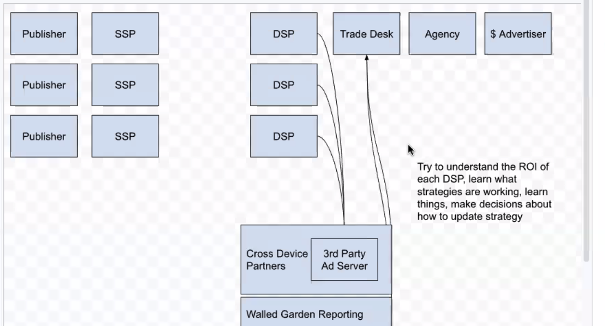

# October 2022 Virtual Meeting

The Private Advertising Technology Community Group's meeting will be meeting two days for 3 hours at the same time both days.

## Schedule

### Day 1 Start

| Time          | Day    | Location      |
| ------------- | ------ | ------------- |
| 22:00 (10 PM) | 25 Tue | Tokyo         |
| 00:00 (12 AM) | 26 Wed | Sydney        |
| 06:00 (06 AM) | 25 Tue | Seattle       |
| 09:00 (09 AM) | 25 Tue | Boston        |
| 14:00 (02 PM) | 25 Tue | London        |
| 15:00 (03 PM) | 25 Tue | Brussels      |

### Day 2 Start

| Time          | Day    | Location      |
| ------------- | ------ | ------------- |
| 22:00 (10 PM) | 27 Thu | Tokyo         |
| 00:00 (12 AM) | 28 Fri | Sydney        |
| 06:00 (06 AM) | 27 Thu | Seattle       |
| 09:00 (09 AM) | 27 Thu | Boston        |
| 14:00 (02 PM) | 27 Thu | London        |
| 15:00 (03 PM) | 27 Thu | Brussels      |

## Joining Information

[Zoom](https://mit.zoom.us/j/95356244879?pwd=NDBwZmxleTMwcHFpZG1MZW1tUXhVUT09)

## Agenda

### Day 1

- == 10m Intro, Google Doc, Read All About It, Call for Scribes
- => 55m Private Measurement Document Work: Important design dimensions
- == 5m break
- => 55m Private Measurement Document Work: Key use-cases that differ on the dimensions
- == 5m break
- => 50m Private Measurement Document Work: [Layering ideas to support different vendors making different decisions in a (somewhat) interoperable way.](https://github.com/patcg/meetings/blob/main/2022/10/25-telecon/Layering%20Ideas%20for%20PATCG.pdf)

### Day 2

- == 5m Call for Scribes
- == 55m Buy Side Perspectives Part 1
- == 5m break
- => 60m Buy Side Perspectives Part 2 [Measurement in advertising slides](https://github.com/patcg/meetings/blob/main/2022/10/25-telecon/Measurement%20in%20advertising.pdf)
- == 5m break
- =< 50m Anticipated Private Measurement Document Work overflow

## Minutes

[Minutes Document](https://docs.google.com/document/d/1qG3AWxEMZjhCwrGKBQK10r_2GgwJQWDwjKGlXeHE4kw/edit?usp=sharing)

### Read All about It!

[Slides to Read All About It!](https://github.com/patcg/meetings/blob/main/2022/10/25-telecon/W3C%20Read%20All%20About%20It!.pdf)

### == 10m Intro, Google Doc, Read All About It, Call for Scribes

Aram: Schedule for today - reviewing the document, [Issue 78](https://github.com/patcg/meetings/issues/78): 

[Document link](https://github.com/patcg/docs-and-reports/blob/8ed009af58ae5f9ebdb5bb56d66ffe764127825b/design-dimensions/README.md)

Charlie split the list into three main points, that grouping will be our schedule today. Next meeting, we have an overflow hour. 

Thanks to the editorial team for putting this together!

### => 55m Private Measurement Document Work: Important design dimensions

*getting the screen sharing organized* [[shared doc](https://github.com/patcg/docs-and-reports/blob/8ed009af58ae5f9ebdb5bb56d66ffe764127825b/design-dimensions/README.md)]

Charlie: We’ll start by presenting the github (link here)

A bunch of us met up at TPAC to begin drafting the document after aligning on Goals in the last TPAC 

Let’s figure out where the lines are between proposals and where they differ

Then we can figure out where the differences are even if we are not all aligned 

We can then use this document to help us layer ideas on how to resolve these disagreements with a layered API approach where different browsers can choose different parameters or to layer on additional functionality. 

For the rest of this ecosystem we wanted to evaluate these design dimensions on where these things differ and the key use cases people want to have this API solve . That is what this document is based on. 

The layer idea is folded by Erik into the thread model for the last part of this discussion

Charlie: We’ll come up with short ideas for layering for each individual idea we’ve identified as contentious. 

The plan for this meeting is to go through the dimensions, go through each one and get everyone on the same page with a short discussion. Also give people the opportunity to raise concerns. If there’s someone who absolutely believes that an API shouldn’t use a server, for example, now is the time to raise it. 

The goal of this exercise is to identify which rows are not contentious and then move on to discussing the ones which are and discussing the merits of each approach. 

Charlie: Top of the doc has a bunch of acronyms. 

Sam: Please drop this link into GitHub? 

Ben: It is in a PR

Wendy: added to the minutes doc [[shared doc](https://github.com/patcg/docs-and-reports/blob/8ed009af58ae5f9ebdb5bb56d66ffe764127825b/design-dimensions/README.md)]

Charlie: Hopefully everyone will eventually be able to find this. It goes w/o saying that this is still a PR. We want to go through a review process, you can make comments and ask if there are still changes that need to be made here.  If you are an expert on a proposal and something is missing, please make an edit. 

Charlie: Ok, I broke these out to the “major major” design dimensions that radically change the API and its output. THe criteria here is that different choices will lead to major design changes and architectures and potentially impact interoperability. These have tons of downstream effects on not just the use cases but also the minor dimensions. This is my criteria and we can talk and bikeshed but that is the major setup. 

The first big question is- do we use a server or not? This is the big decision we are not yet aligned on. Some browsers, for example Safari, has not yet entertained using a server for their APIs. Every other browser has considered it and has a proposal which has a concept around this. [lists current proposal acronyms]

It impacts immensely the potential output of the API 

An output of a server mediated mechanism allows for a wider range of outputs because you don’t have to allow for the data to be immediately private when it leaves the device. It allows the server to privitizse the data and mix the data with that of other users as part of that process. 

I’m not sure if we have Safari participating today but we should talk through this. 

Martin: One of the more interesting points here is when the information leaves the device what’s the nature of that information. When it leaves the device how much do you trust the servers to handle that information so the final output of the system is appropriate. A lot of people have raised concerns about what leaves the device but the proposals here don’t concern me on that area. The question is are you effectively releasing a tracking identifier or something else from the device. The question is what do we need to do , if at all, with differential privacy on data leaving the device. That doesn’t concern me. I’d rather concentrate my efforts on making sure the servers are trustworthy. 

Charlie: Does anyone have any immediate concerns?

*convo about doc and queue management*

Mariana: I guess my comment is along the lines of what Martin is saying. Maybe we need to be a little more specific about what it means to use the server thinking about what the server is allowed to learn. Secure aggregation style designs use the server. Now there is a question of designs like PCM which also corse the data and leak info to the server at some point. What do we want to reveal to the server is really the question instead of if we need to use a server? 

Charlie: The security of the server is a minor dimension further down the list. Maybe we shouldn’t split this into 2 but I think there was some philosophical non-security guarantee discussion around using servers in this process. We could say that we all agree servers are part of the process and differ on security properties. The goal is for us to all align on server mediated design or not. Then we can move on to what are the security guarantees in the system. 

Mariana: Even in some sense isn’t every solution using a server? Are we assuming that others are directly sending it to the server? 

Charlie: The difference is the output from the API is coming from a server instead of a client. Whatever happens after that is post processing in the hands of the user / advisory. The platform is in control of the data where the output is coming from a server infrastructure. A server used to process the client reports is always required but we’re talking about the API boundary in terms of control. 

Brian: When I was thinking of this dimensions I was thinking of colocation and aggregation in regards to the server, which is different than using it for privacy rules or other clients. We should distinguish where the server’s functions are.  

Charlie: Co location? 

Brian: If you want to do aggregation all the records have to be in the same place. With PCM you are going to do an aggregation at some point but with PCM the person doing it is not in a shared public infra but in their own servers. 

Charlie: API Boundary as differentiator is that a good way to talk about it? 

Brian: I think we need to figure out what functions have a boundary. 

I think we could see PCM having some sort of boundary with a direct relationship with the servers even if it doesn’t right now. 

Charlie: With all the server designs on the right the design is dependent on the server to implement the privacy mechanism. And by doing a server we can implement a more useful functionality. The server is implementing the privacy mechanism and then there are other auxiliary roles. If someone is implementing servers are we ok implementing servers for some things or for all the privacy mechanism mediated by a server. 

Erik T: Reply to Mariana - we want to outline what the servers can learn and have that in the threat model the question here is if there is a server at all. 

Ben Savage: I thought Charlie described it quite well - in this private measurement system are there servers? Yes, the person who gets this output has a server but the question is if there are servers inside the system. Does anyone have specific concerns with there being a server at all in the API. 

Aram: (I got this)... If people are having difficulty, Ben got at it well.  The question we need to get to is whether this API is dependent on a server outside of the control of the receiver of the data.  That server is involved in applying some privacy mechanism.  We don’t need to agree on the details of the mechanisms just yet.  There has been this division of servers receiving data that is not private in order to make it private in order to make progress.

Charlie: Ack, yes.

Brian: Just to address Ben’s question - I would prefer not to have a solution that doesn’t have a server a company has to have a relationship with that we’d have to stand up and administrate, like PCM. It’s a question of if we are going to get this thing stood up. 

Charlie: Ok, like a timeline concern.

Mariana: Objectors - I think the people objecting might be from people who have privacy objections on the question of making it completely private. It is hard to say ok without knowing more and than the other question is if it is reasonable to stand up the servers in a reasonable amount of time

Charlie: Introducing servers, even if we have very sophisticated techniques, involves extending your circle of trust in some way. Even if we have an MPC where 120 parties ned to conclude. If there was a trustless way to do server-mediated I would agree with but I don’t think that is where we are currently. I don’t think that is the case I think it is conceptually clean to ask - extend the circle of trust? 

Mariana : Is this the perspective of the user or the advertiser in terms of trust? If just sending diff private data from the device someone is still getting data. 

Charlie: I was thinking about this from the user’s perspective. 

Martin: My concern is that we can spin our wheels on this for a very long time and I’ve not heard a significant objection beyond can we make it happen which is reasonable but I think it is worth trying. We’ve been talking about this for more than a year and I think it is time to move on. I beg the chairs to put a process in place on deciding this in the next three weeks. Then we can proceed. We shouldn’t keep going back for this 

Aram”: I think that’s reasonable. I hear this as a request for a consensus call. I agree we’re at a point where we need to progress on this topic. My hope was we would come out of this with a formal answer but that’s not the case. We’ll position this as one of potentially multiple dimensions on a future specification. Open new issues on the private-measurement repo for each dimension.. Call for consensus with a timeline of 3 weeks. Gives us enough time to have the call, settle on the results, make a meeting schedule agenda change on the basis of that decision. Does anyone have any objections? No objections.

* **[ ] CALL FOR CONSENSUS: SERVER MEDIATED?**

Ben: If we open this as a Github issue, how to avoid rambly conversation thread that is not an objection?

Aram: Let’s make it clear that if people want to object, they should say “I object” and if they want to ramble on later in their position that’s fine.

Sean: We will make it clear and give people instructions on how to object, but people are going to do what they’re going to do. 

Erik: One of the APIs that differs on this dimension doesn’t seem to be represented in this meeting and we should reach out to them. 

Aram: Agreed, chairs will make sure they are aware and can comment on the thread. 

Charlie: Alright let’s move to the next hot button issue. This is ordered by priority in terms of how different this API will look. This next one is about what is the definition of privacy specifically for the output of the API. Are we talking local or non server mediated then it is after it leaves the client; if it is server mediated it is after the server processing. There are a number of things we can choose - there are examples of APIs that use differential privacy, some use information theoretic, entropy or aggregate definition like k-anonymity. 

It is reasonable to choose multiple definitions if we feel one is not sufficient. There are examples of that in existing proposals like the Event level API. We use [] to prevent 2 different types of attacks, including where adversaries are trying to track many users at once. PCM uses information theoretic, IPA uses differential. SKAN uses information theoretic and k-anonymity. 

This is an important topic to discuss and I wonder if anyone has burning comments here. I know Martin has posted a blog post. Welcome comments 

Martin: [ blog post ? ] You know my opinions on the scale question and t/f can assume my opinion on the information theoretic process. I don’t think we are going to get a whole lot of debate on the details of how much K in k-anonymity or other parameters. 

Charlie: Yes, we’re not choosing parameters but this is about definition. The goal here is to allow people to raise concerns. I think your concern is that only information theoretic is not enough for you. For me k-anon is not sufficient on its own. Let’s move to the queue. 

Mariana: Is the issue about this dimension to choose between these notions or how to combine them or to object strongly to one of them? 

Charlie: We want to I’d where we have disagreements - I think there are already some disagreements which we can see on the right column where some proposals have made different things. The biggest objection here might come from Apple who uses the information theoretic process only, but we’ve already heard from Martin that he would not be comfortable with only that approach. We need to find disagreements so we can focus on resolution 

Graham: Composability is really important here. Are we debating if the use of these as tools to deliver the degree of privacy is objectionable? I don’t think anyone here would disagree that we can use these as a means to use in combination, even if there is an objection to use them by themselves. I think we can generally agree on using multiple. But I think we need to understand what the final measurement of privacy looks like. Do we have to have one of these to feel like it is adequately private? It seems the question is: What has to be in the definition of privacy and what on its own is insufficient?

Charlie: This is us setting up a framework to innovate inside the circle we have defined. If we are very vague about what we consider private then we will constantly be relitigating and having new arguments. So if we can agree about the privacy threat model and what it means for the output to be private we can nip these arguments in the bud. 

Graham: People need to make definitive statements - it must include X, or if it includes Y it doesn’t work for me. That is what we need / the best we can do here. One question to draw that out: is a solution that doesn’t include differential privacy acceptable? I suspect there is some religion around that.

Charlie: My pref is that Diff privacy be included.

Brian: I simplify these perhaps incorrectly to - limited information release or using something to disguise more information released after the fact. I think it can be sufficient for standard design to say if you are using X or Y these are the characteristics to enforce / limits. 

We may come up with something better as long as we are clear with what the implementer is getting into. 

Erik: Agree with Martin. I don’t think this is contentious - I don’t think we need to zero in on it at this point. I will point out that with the server mediated case we can support any combination. On the client side you are more limited. In practice it seems limited to local DP and information theoretic. Finally - on personal prefs - I generally agree that diff privacy should be included. That seems to be the best way I’ve seen to capture this. 

Ben: Opinionated statements please! I would love it if we didn’t have to include Diff privacy but I don’t know anyway to not add DP and still have a reasonable privacy guarantee for the end users. I think the solution must include Diff privacy. Otherwise it is too easy to link the data back to individuals. If we want it to be unlinkable to individuals it needs diff privacy. No combination of other things works without it. I prefer central DP instead of local DP. 

Mariana: DP is great but DP without hard requirements on params is useless, potentially worse than the others. 

Charlie: This is pretty much why we used a hybrid approach in ARA - the information theoretic is a backstop (or either could be thought of as a backstop). We have different boundaries depending on where the others stop. 

Brian’s proposal is maybe we don’t need to align on this. Can we discuss this idea offline on an issue? Thanks. 

Charlie: This next one is fun. Architectural questions - are we doing attribution on or off device. Obv this is solved if we are not doing servers. Every proposal other than IPA is doing on device, IPA does server mediated off device attribution. 

Biggest question is a scale question - if we are doing server side infrastructure and that takes information already attributed I’d say scale is 100x to 1000x smaller and this raises questions about cost, especially if servers are expensive to run. This also raises trust assumptions about scale and data flowing into servers - the type of data flowing in is raw event data arguably you could say this is much more sensitive. From a data minimization point of view this has some issues. On the other hand there are a number of downstream dimensions on which off-device shines like fancier attribution models - cross device, online to offline, cross env, more and more stuff in the server gives you more flexibility. 

My personal opinion - I don’t have strong concerns with off devices as long as we can show it is feasible. If we can do that then I feel good about it. I also don’t mind on-device, I’m willing to explore both, off-device if feasible is great. 

Ben: A couple of things Charlie didn’t cover related to on device/off device. Information leakage. If you emit information toward the client you leak some information about the rate of conversations. Surface area for linking back to conversion. From a pure privacy standpoint I would argue the pure server side is more private. There is no extra information coming off the client.

(Charlie: see [https://github.com/WICG/attribution-reporting-api/issues/439](https://github.com/WICG/attribution-reporting-api/issues/439) for more information about what Ben is saying about leakage)

The amount of ecosystem code running on Apple or Google devices means we’re very dependent on those two devices if we don’t use servers. Updating the logic requires OS and browser updates which is a bottleneck and a big reliance on effectively two companies. Servers can be updated without that bottleneck.

Paul: assuming scale works, attribution models are critically important for this to be taken seriously by industry. 

Martin: make sure we address the question of whether we’re setting ourselves to remove certain future use cases if we put everything on device: for example cross-device. If we can make it work off device, we should aim for that.

Graham: building on cross-device conversation. Flexibility is super important. Cross-device is one example of that. Don’t think it’s hard to imagine that in 5 years we might see connected TVs driving significant impressions, but conversions taking place on other devices. If we preclude that now we are making a pretty big utility call. I don’t see how you build a standard without this kind of flexibility.

Paul: CTV is an important example, and illustrates an example of a growing trend.

Erik: It is critical that we figure this out in the core standard. Probably discussing on thursday too. We have some ideas about how to add flexibility where vendors are open to servers/MPC/TEE.

Thomas: Agree with the point on flexibility. If we can address more niche use cases and innovate there we should leave the door open for that. Server side may be better for that.

From a scale perspective, everyone is already doing things server side. The question is how you make sure data is private (and have scale).

Mariana: scaling is only relevant when we are thinking about scaling AND private. One thing I want us to think about is that we don’t push down privacy benchmark with the desire to scale. Does this make us readjust our privacy and security model? Since we don’t have anyone from Safari, I want to reiterate Apple’s reservations. How is server side model conveyed to end users in terms of trust.

Charlie: unfortunately Safari/webkit aren’t here today given they have been the primary hold out. Not sure that we’re ready for consensus, but it would be good to get some sort of position from Apple.

Aram: Chairs will reach out to apple from feedback on these points

Erik: it would be helpful to get input on what it means to scale? What are the readlines on cost and number of events.

Charlie: This was my second point. I want to make sure we’re all on the same page when it comes to what operating at scale means. If ad tech players could talk about scale examples, that would be great. For example: “Here are the sizes of advertisers I’m supporting and the number of conversions they are driving.” This would give us a better understanding of whether what we’re doing works. The cost question is another good one. It’s probably more down the road from the scale question though.

Paul: the question of scale is different geographically. Willing to share some data though.

* **[ ] REQUEST FOR DATA: What is the cost for supporting an advertiser. How much data (in the form of unattributed imps / convs) do you need to support large advertiser queries?**

### **== 5m break**

**Next Topic: “Where is budgeting applied?”**

Charlie: This one is a bit subtle. Maybe it’s not super super major. Different proposals have pretty different ways of addressing this. Many proposals do it on device. Perhaps rate-limiting on device. How can we set limits such that privacy goals hold.

With the server mediated proposals we have a diversity of proposals. ARA uses bounds on device and servers are just there for anti-replay protection. 

IPA does all the contribution bounding on the servers, the devices can emit all the info they want.

Unclear about SKAN. Probably on-device rate limiting.

Philosophically if we all align on “servers”, the question is “how much are we putting on the server?” Similar to last question. A historical note: ARA -> one reason for this hybrid approach was to make this compatible with “simple MPC designs”, minimize the server responsibilities. Helps make the server just sum-up in a dumb way. If we are willing to tolerate more complexity on the server, we get more privacy efficient designs / better use of budget. This is a question of “how much logic is on the servers”?

Erik T: There’s 3 different things going on here, all a bit different. In this total set of queries, how many queries does an individual show up in. Within an individual query there’s “how is the noise added?”. Trivial to add in MPC, not that fancy. But you also need to max-out a per-user contribution. To do that entirely on the server is a bit tricky. We’re working on it with IPA. Also something the on-device proposals benefit from. 

Charlie: We can take an action-item to expand this. It’s only talking about the third one. We don’t talk about these other aspects. It seems like you’re agreeing this is just about complexity and pushing responsibilities to the server. Do you have a position on is the IPA model necessary?

Erik: That’s ultimately a tradeoff on complexity / cost vs flexibility. I generally come down on the side of flexibility unless the costs are particularly egregious. I don’t have a strong opinion. 

Charlie: I generally agree with you Erik.

Brian May: It’s important to consider it from the perspective of the user. How much data are they contributing to the server. Do I have any control over how much leaves my device. I need to trust server to budget appropriately.

Martin: The privacy-efficiency is the key thing to focus on here. We’ve focused a lot of effort on trying to get any privacy-efficiency. To Brian’s point about what leaves a device, the other one is “what data leaves the system?”. When you try to apply this at the device, it’s not particularly good. It gives you something between terrible privacy and terrible efficiency. In a central application you can get something that’s maybe just good enough to use. That’s what we are looking for here. There’s a number of things we can explore here.

Erik: In terms of where the noise is applied, I strongly agree that should be server-side and the central model is highly preferable to local model.

Martin: The only data that leaves the device is a secret-shared and encrypted ID. That’s a lot of data. Applying DP to that is not feasible. 

Graham: I agree with the point on the flexibility and the efficiency. The question is - if you set the scale question aside, and assume this is feasible, does anybody have any hard objections to the privacy / security model to use servers to add noise. Then it’s more of a feasibility question. Let’s get to consensus easier. 

Ben: I want to echo what Martin is talking about we have to get the best privacy tradeoff we can./ I’m worried that the need to apply DP will make things very hard. I worry about fighting to get signal through the noise and want to add as little noise as possible while still getting to the privacy bar. It’s why I want to manage this server side. It gives us capabilities that make this API more desirable. Currently the server side attribution part is much more costly than the user capping part so if we can make the server side attribution part scale we can make this scale. 

Erik: I’ll echo what Charlie said. We need to split this into 3 categories. Need to figure out how they play together. We are somewhat talking past one another. 

Charlie: I’ll jump in and say - I’m not seeing too much opposition to the “everything in the server” option. At least for this audience, it’s not a crux. It feels like we are close to alignment here. Maybe this will just get resolved by some of the other issues.

Braedon: Want to suggest that the group we are discussing likes server-side, the user-privacy side - this is a harder sell. Regardless of the detail - users won’t understand the detail. How do we make them trust this - when more happens on a server. I think the ease of this conversation is different from how it goes down with users.

Brian: I’m assuming the model we end up with in the future is that users have some level of control over what data escapes their device. I don’t think we will end up in a situation where we say to users “let us take all the data”. We will need accommodations for limiting what escapes the client.

Mariana: I know we heard arguments server-side management is more efficient for utilizing DP, but we are sending more data off of the client. 

Erik: More data than what? 3rd party cookies?

Mariana: More data than when the attribution is on device.

Ben: Draw a distinction between the actual privacy guarantee offered by the system and the simplistic privacy stories we can tell to someone who doesn’t understand the tech. If we are talking about the actual privacy guarantees we aren’t making a privacy tradeoff. We’re trying to offer the highest privacy level to people. If we are capping it on a device level then we’re actually doing a better job by managing the information that flows and is capped. I do think there is another situation here which is how simple a story can we tell. Most of the world is unlikely to get into the details but I’d like to think that those of us who design the system can talk to the 1% who are interested so that we can affirm that we have designed a system that does protect their privacy. 

Mariana: I’d keep channeling Safari’s concerns - whatever infrastructure gets compromised do we have to worry what happens in this case? 

Ben: We have an item for this and I think it is orthogonal - we have to set it up in the server design so it doesn’t leak. We have a set up so the server if it gets compromised then it doesn’t get leaked. 

Mariana: No, I mean the WHOLE system where everything gets exposed. 

Braedon: Yes I agree - there is fundamentally a privacy difference between keeping information on the device or sending it. I’m trying to suggest that we need to be aware that there is a difference between the two and that is important - we need to design a system that users will use as much as one that advertisers will use.  

Charlie: It feels like what we are arguing for is a little unrelated to capping the user contributions. Are we interested in the hybrid threat model where we are concerned with the whole system being compromised? None of the server proposals have this formalized, they assume the server infra is completely trusted. As a whole it means we are leaving out of the threat model some of the extreme cases and we could choose a different tactic that gives us a DP guarantee even if the system is cracked by protecting the data a little when it leaves the device. But this will degrade utility in all the ways local privacy can degrade utility. I think we should discuss this formally and have it as its own thing not just inside the user contribution discussion. User contribution capping doesn’t protect you from a local sever. Even capping doesn’t always help b/c we are sending out high entropy identifiers. I can add a row here for hybrid protections 

Aram: I do think we need to break that out as a separate row. This reflects a concern from the Safari crew, and potentially opens up interesting discussion about device control and vendor decisions that would bring us into alignment. If you could take this as a point Charlie, we can take that back up.

Ben: If we did add a new dimension of “what if everything breaks?” it will say ‘totally unacceptable’, which is why they are designed intentionally to be so hard to break that it should be practically impossible. Even if there’s only 1000 events per website, you can still learn a lot. Rather than focusing if some terrible thing happens and if it still protects privacy, I’d rather spend our time on how high should that bar be?

Braedon: The thing about what leaves the device, you can make the argument that all the data leaving the device is that it’s a limited type of information. Yes we can say that none of these will stand up if all this is compromised, but what you get is different, and that’s key to explaining it to users.

Aram: Appreciate the user voice here.

Charlie:  Next up, scope of attribution.  All about how the algo operates with respect to cross channel or cross ad tech.  With ARA, the locus of control is the ad-tech and that design decision led them to within-ad network measurement.  Avoids issues like stealing credit.  IPA proposal on the other hand puts the locus of control in the advertiser’s hands and allows them control allocation of credit.  This allows them to do cross channel, etc.  More flexibility.  PCM is on the other side of the extreme in terms of inflexibility.  PCM only allows you to do attribution scoped to a publisher – ads shown on any one site.  No real notion of an ad network / ad tech.  SKAN does allow cross channel attribution but they put the locus of control on the advertiser side, but there’s an explicit registration on the source and event side.  Key question is whose wishes do we serve.  Advertisers are the end customer, how do we loop them in.

Brian:  Can you clarify the concept of an ad tech / “within a single ad network”?

Charlie:  Question is whether you can have multiple parties involved in a given event and whether you can observe and provide attribution credit.  With ARA this is possible.

Ben:  Agree with Charlie on the importance of putting the advertiser in control.  Real question is which attribution heuristic is most accurate.  Problem is that everyone has conflicting interests in this space.  Which is why IPA tried hard not to force a particular approach on everyone.  Sad but true reality is that multiple parties take credit for the same conversions, which means we end up with more conversions in reporting than in reality. Which is why companies like mobile measurement solutions exist – to reconcile.  Other important thing to consider is that certain ad platforms are more likely to get credit in simple attribution models…such as search.  Can’t really allow any of the ad techs to decide which type of attribution logic to decide because of conflicting interests.

Aram:  PCM does provide publisher metrics but does allow delegation to another party such as an ad tech.  Issue is that none of the stakeholders - publishers, advertisers, ad techs - don’t trust each other because they have significant monetary incentives to bend rules.  Like the idea of being transparent to all parties, but that must include the publisher.  There is significant fraud in the system and hope is that a new way to handle this can increase the transparency can help address this fraud.

Thomas:  Mostly going to back what Ben said.  We aren’t an industry where everyone trusts each other.  Very important to have a third party measurement party involved.  Very important to have innovation. If you have a new player or channel that gets involved in ads that can’t be trusted, you need a third party to be judge.  Also important for cross channel.

Alex:  Main takeaway is Thursday we’ll have practitioners share how they allocate ad spend.  Opportunity to ask questions about how they make these decisions.  ONe of the participants hammered home to me why there are structural reasons why there are multiple parties measuring, beyond just the trust issue.

James Aylett (cross-channel attribution will never give an accurate view of attribution anyway; doesn’t mean that better than siloed isn’t a good idea though): Going to echo Alex, but with slightly different spin.  Even if you have perfect attribution in digital, doesn’t mean you have perfect attribution given offline conversions and impressions.  Worth everyone thinking about questions for Thursdays.  If you have a attribution system which only measures in silos, you can still feed that data into a larger system.  Won’t be perfect, but still useful.  

Charlie Harrison (adoption trade-off, row on configuration/third parties, request for Aram): Couple related points. One of design criteria for ARA was to make the system as adoptable as possible.  Advertisers shouldn’t have to lift a finger.  More we put control in publishers and advertisers control, the more challenging we make adoption.  Need to keep adoptability.  Should have defaults so that lazy parties get reasonable defaults.  Providing control to parties = configuration required.  There’s also a separate line on third parties, which we should also discuss. Last request:  Aram has provided good feedback on publisher transparency to provide feedback on what’s missing in terms of publisher control/transparency.  Hard to know the implications for some of these designs in terms of what would need to change.

Aram: Can create write up and invite other pubs to weigh in.

Charlie: Can we think about what we’re going to discuss.  Tomorrow we’re going to discuss layering.  Let’s talk about security guarantees of agg infra since it’s part of tomorrow’s discussion.

### == 5m break - return at 20m after the hour.

Charlie:  Security guarantees of agg infra row.  This row is focused on the security of the server doing the aggregation or playing other roles.  With ARA, this happens within an TEE.  Within that system there’s an isolated execution environment.  Data can’t leave or be processed other than very specific binary.  There’s another party that ensures only those binaries can run and provision a key if so.  So as long as coordinators aren’t colluding, system is secure.  IPA doesn’t require on a cryptographic protocol using three separate parties.  If one party colludes or is malicious than data is still secure. Could imagine more secure approach would require all parties to collude to compromise security.  SKAN leverages trusted platform-owned servers (the app stores) to do aggregation.  Erik has some layering ideas which could allow parties to determine which backend approaches they prefer.

Erik:  Between ARA and IPA, there shouldn’t be any reason that they shouldn’t be compatible.  ARA has shown it’s compatible with MPC.  IPA could work with two parties or with TEEs if that’s where we landed.  Not a hard difference.  Given that other conversation is about use cases.  Is it better to discuss use cases when we have other ad tech people here?

Aram:  If we’re ok switching to layering, probably better to do so.  Would assume that folks joining us may not be as technical and capable of engaging on use cases.  

Charlie: yes, let’s reorder.

Brian:  When we talk about security guarantees we need to look at how we will verify that the guarantees we make are trustworthy.  On device can be verified.  Promises aren’t enough in the case of IPA and ARA. 

Charlie: Where I stand, to bring back to opinions. I believe that the TEE option gives us the flexibility to innovate on what exactly the computation we support allows in a way that is easier for us to understand what the scaling implications are. With MPC, making a small minor change can cause cost to explode. Adding a requirement can cause the system to not work. TEE is very good at scale and flexibility, MPC has some more robust security guarantees. If there was a magical MPC that offered general computation in a scalable way, it would be great, but I’m cautious on this concern. Would be difficult to support an MPC only, and in favor of a hybrid approach.

Graham: Contrast that a little bit with a trusted platform server. I don’t know unless you have special trust in a platform, really affords the security of either approach. Dont think that a system that just puts trust in Apple or anyone else is acceptable.

Thomas (scale / business model vs. utility vs. privacy guarantee):  Don’t think we need to decide which technology is best.  Needs to align with requirements we set, but don’t to prescribe.  WE need to rate each solution on scale of costs, utility vs. privacy level.

Nick Doty (choice of trusted sets):  Maybe I need to hear more about layering.  One factor consider is that there need to be multiple options to provide competition.  There will need to be some configuration or coordination of the system - and parties to play this role.  Each config needs to be explainable to user.

Ben Savage MPC + TEE option: Important thing to explain to user is not the underlying tech, more important is the security it provides.  Hurdles that would have to be overcome to compromise data.  You can come up with a system of guarantees that would require going to great lengths to break. True of both MPC or TEE.  Don’t have to choose just one.  As Charlie pointed out it’s a majority honest protocol.  Two of three must be honest.  You can layer on another layer…attestation.  To ensure they are running the code we expect.  Now you ensure than collusion is required AND they break TEE attestation.

Mariana:  More questions about combining.  There is a way to combine them but will likely increase complexity but it may weaken overall security.  Are we trying to make a judgment call on the security guarantees?  Doesn’t feel like we have the expertise to do that.  Or maybe the goal is just gut opinions.  

Charlie:  What is the minimum security bar.  If we’re not all aligned then we should take a layering approach or continue arguing until we arrive at a bar. 

Mariana: Do we need to have one approach that all agree on?

Charlie:  Can agree to disagree or agree to not disagree.  Thats what the layering discussion is about.  Don’t have to agree.

Graham:  Can we agree that placing trust in a single party isn’t acceptable?

### => 50m Private Measurement Document Work: Layering ideas to support different vendors making different decisions in a (somewhat) interoperable way.

Erik:  Layering here is about supporting the different choices not about necessarily combining technologies.  Standard parameters could include unit of privacy and epoch, then there are vendor params.  On MPC we are likely at consensus that it is sufficiently private, not the case with TEE.  Should have a standardized methodology to allow for a uniform bar, but could extend with another approach.

In both MPC and TEEs, there are help parties of some flavor.  Responsibilities include limiting usage to a predefined approach and applying a privacy budget.  

On the privacy budget, one of the issues is how to split the budget.  If we suppose a browser has a given budget (5) you could assign that budget to different helper nodes.  Then you can bring in the idea of browsers/OSs supporting different types of instatiations (MPC or TEEs), now you can imagine them distributing their budget to various combinations of instatations and nodes. 

Martin:  Bunch of discussion is on IRC.  If we agree to disagree creates a potentially bad dynamic.  Not a good situation if websites treat different browsers differently based on measurement.  May be ok with a browser with high share, but will disadvantage browsers with lower share.  Mozilla may choose not to support aggregation at all if we can’t all agree on an approach.

Charlie:  Point resonates.  Would be good to know what the minimum bar for alignment is.  We should try to resolve as much of the misalignment, but question of what elements are acceptable for different approaches (extensions) to address.

Martin: Ok if its on the margin, we can address with privacy statements.  If there are orders of magnitude different amounts of data shared by one browser vs. another.  Let’s say you want to do optimization.  Imagine you can get what you need from one slice of the market / browser.  THat’s potentially an option they (mozilla) would be ok with.

Charlie:  Would like us to consider a more complex approach to privacy budgeting that includes backstops to ensure there aren’t ways to enable the worst case attacks.

Erik:  Privacy budgeting is definitely an area that needs more discussion.

Aram:  Please look at the slides Erik has provided for the issues that focus on these questions.  

# Day 2

### == 5m Call for Scribes

* Thread for questions - [https://github.com/patcg/meetings/issues/80](https://github.com/patcg/meetings/issues/80) 

### == 55m Buy Side Perspectives Part 1

Aram: We’ll be hearing about the work on private advertising from the buy side, the people with the money who are buying the ads. Hopefully we’ll get an opportunity to get questions answered and hear their opinions. Heads up, this meeting is not recorded, but we have detailed minutes and publish them. If you’d like something not in the minutes, let us know, but this is a public meeting with lots of people.

To start us off, Alex has kindly connected us with his guest Laura.

Alex: Why I thought of Lara: worked together at AppNexus. Was running ad spend through the DSP. I learned so much from her over the years, and how the ecosystem works for someone who gets a pot of money they need to spend. Hand it to her.

Laura Chin: Thanks. When I was invited, I had to go back and think of some of those experiences. What I prepared today may be outdated. Cookies/IDs were widely available. Maybe can give some insight into the chaos of getting money and trying to optimize. Hope this is informative. In addition to Alex’s intro, I’ve been in the industry for 8-9 years, also at Xandr. Publishers, advertisers, everything in between. Now at MS IQ, working directly with publishers. Alex invited me to talk about the complexity. One of my roles was executing campaigns. Building, optimizing, campaigns to reach very specific metrics, ROAS, viewability, supply sources. Managing 100M in spend from a single advertiser. 

To start off, let me share my screen. Visualize where the money flows. [Slides with parties.] Advertiser has a high level idea of who they want to reach, all the way to the individual user who is shown that ad. Starts with the advertiser, they have the money, determine their budget. Using market research to understand their benchmarks, generally have some ROI they want to reach to break even. Hire a media agency, i.e., WPP, etc. Specialize in media planning. Bring expertise, such as digital media, have to divvy up budget. Radio, TV, digital, out of home. How do you split up the budget and what partners do you work with?

3rd bubble is the trade desk, in the DSP, building and launching the campaigns. Lots of these sit within the media agency. This is the rectangle that I set in, I was the “trade desk” executing the campaigns on behalf of the advertiser. 

From here we enter into the exchange where the DSP is integrated with most of the exchanges. All of this landing at how does the money move to actually show an ad to a user on whatever device / connected TV / etc they see the ad on. The flow is complicated, and only gets more complicated in trying to explain why there is so much friction.

First question I like to approach: why use multiple DSPs? Potentially because of walled gardens, e.g. FB, can only buy directly on their platform. That will always exist for that reason. Other walled gardens like YouTube. A second question, the more DSPs you work with the more inventory you have access to. This has changed recently, wide adoption of PMPs [Private Marketplaces] and deals, header bidding, all resulted in rebalancing this situation so that you don’t have to interact with a specific DSP to get to specific inventory.

Something was happening across multiple DPSs, they were bidding themselves up. With lots of DSPs in these exchanges, you bid on the same impressions. Deduplication lowers CPMs. The industry has evolved, this has consolidated, but it’s still not perfect. Sometimes DSPs stay in the contract because someone knows someone, and walled gardens.

So out of all these players, who’s measuring and doing attribution? Who’s the source of truth? Most advertisers use a 3rd party ad server (advertiser ad server.) They create advertiser tags. They can update the creative as they need without updating tags. Primary purpose is to be the source of truth of delivery, clicks. Measuring it across all campaigns, regardless of how many exchanges or DSPs. The 3rd party ad server has their pixels placed on the advertiser site, when those fire off, they send back to the ad server, where the attribution process happens. That ad server can figure out what impressions deserve credit. Every DSP get their own tags, so the ad server can see which DSPs get attribution credit. It becomes competition to other partners. Goal is to beat them to get more of the money. This third party ad server is the source of truth.

DSPs are also measuring and attribution conversions. They have priority systems that allow them to bid against clicks, conversions, other behavioral info in the header, cookies, etc. The DSP has their pixels installed on advertiser pages to optimize off those events. If I’m a trader at DSP1, using my DSPs algo to optimize my campaigns, but the actual source of truth lives in an external 3rd party ad server. The DSP is using signals that aren’t technically the source of truth. It could be using a conversion event that technically belongs to DSP2.

A couple more niche use cases. Multi-touch and cross device measurement partners. This evolved while I was trading. These specialty companies would allow for extra measurement information. There’s a wrapper around the creative tags, where the 3rd party ad server is doing attribution, and another company is also doing it. Now have 3 potential partners doing measurement in their own fashion.

A couple other partners: viewability and fraud measurement partners. 3rd parties like double verity, moat, that exist somewhere in the middle of the graphic are there to help independently verify reporting discrepancy, i.e. something suspicious like fraud, etc. Publishers are also measuring their own impressions and knowing what revenue is being generated on their side.

Just breezed through that. I’ll stop to see if there are any questions.

Ben: Surprised to call FB a DSP, don’t think of it that way. Should they be SSP1 and DSP1 and the exchange?

Laura: Yes, I think of them as a DSP because they provide a UI to build a campaign, target people, etc. They also have the inventory, so they span publisher, SSP, exchange, and DSP.

Ben: You mentioned that 3rd party ad server is source of truth. But how does it incorporate FB ad manager statistics?

Laura: In the walled garden case, the 3rd party ad server can’t play. FB reporting can’t be reported at a user level, so it just sits on its own. Ads on the open internet work differently.

Ben Savage: How do you deduplicate across walled gardens and open web?

Laura: Short answer is that you can’t. One of the issues as a trader. Advertisers want to see that full user journey. See interactions regardless of device and site, etc. Going into walled gardens is where you lose this. Not here to make judgment on walled gardens, they exist for good reasons. Also happens on open web. Some DSPs do this, some don’t. Not all the blame on walled gardens, but you throw up your hands and say it is what it is, I’ll never have the full picture. 

Brian May: Really helpful to get this end to end picture. Wondering if there’s any good documentation about where the data flows and how the data gets joined together. Is this significantly different for smaller buyers than larger buyers?

Laura: About the data flows, this is simplified. Having not been a trader for a long time now, don’t know the full intricacies. Where do identity resolution partners come into play? How do you use liveramp, snowflake, etc, to put the picture back together. Somewhat unique to marketers to how they build out their tech stack. Can we resolve this back to “advertiser has PII” and connect that to the advertising data. Most advertisers don’t have a fully staffed DS team to build this out in a way they can do that. Lot’s of advertisers just hope for the best, and see performance isolated to a single DSP. Maybe can do timestamp resolution, have a good guess as to who this may have been.

Brian: Would you be willing to put together some form of information about how messages flow in this diagram?

Laura: Sure, may ask Alex to help. Mostly faimilary with identity feedback loop of providing IDs to target people from agency / trade desk / DSPs, and making sure DSP has access to log level data to join that back to advertiser PII. I have a hunch things have changed a bunch.

Alex: Not really, infact doing it more with loss of identifiers. Clean rooms/PII more on the up tick.

Laura: Probably seen lots of pitches for snowflake, infosum.

Aram: Let’s wait til the end for more questions.

Laura: Outlined the inherent problems. Way the industry works, cards you’ve been dealt. Now want to see how you solve for this as a trader. One of my experiences was building up the relationship where the creative tags were duplicated many times, and given many copies of the creative to create a 1:1 mapping from creative to performance. You get handed a creative, and can set up lots of tactics, maybe prospecting, first touch, maybe retargeting someone who abandoned a cart. If you’re using one set of tags, you’re not going to get any breakdown. Ended up working on a project where agency would duplicated creative tags, up to 25 versions, and then when you have a specific tactic, you can assign a given tag and then track that specific performance. One way to tell apart what we were seeing as a conversion vs a 3rd party ad server, and then could match up at the end of the day.

Traders hierarchy of needs. At the base level is delivery. Second is performance, on top of that is insights and analytics. Delivery is important because money is flowing, and if you under deliver, you show you can’t spend at scale, and the next order will be that amount or less. If you got 300k for a month, and you don’t spend it, they will give you less. Agency doesn’t like this as they have to find someone to pick up the slack. As a trader, you’re thinking about how do I hit ROAS, but only if you can spend all the money. And then potentially you’ll get a larger budget. Day to day, first issue is getting as close to a 1:1 of having different tactics, and seeing that in the reporting. 

There’s the actual approach to buying. Everyday you’re looking at different metrics. Take a scientific approach, make a hypothesis, make sure you’re set up to test it. Every day come in and make single tweeks, e.g., forcing a bid higher, changing an audience, give it some time, and making individual changes. DSP can’t ingest this directly from the 3rd party ad server, so you’re the liaison. You have to start using proxies. Sometimes I’d turn off specific optimizations in a DSP and force a bid, can optimize better. DSP isn’t fully taking advantage of signals.

An example of one of these, to visualize. One of the advertisers was for internet and home bundled services. Internet, phone, cable TV. Here’s a paper contract for the campaign. A CPA benchmark, and a rough summary of the target demo. My job to put that paper and translate it into a programmatic strategy. Had one hypothesis, most consumers signing up for new services are moving. How do I find people moving? When do you most notice you’re internet is slow? High bandwidth. I live in NYC and there’s a monopoly on ISP, but ignore that. So what I would do is create different tactics using behavior and demographic targeting. For moving, sometimes it was buying from 3rd party data providers. I also tried contextually relevant sites like Zillow/redfin. Second hypothesis, was buying lots of inventory for speedtest.net, where you can do a internet speedtest. Also YouTube which was available on open web at that time. Streaming video you may recognize that your internet is terrible. Everyday I’d login and look at custom reporting and try to get an understanding of what needs tweaking. Maybe getting good performance, can scale it up, great if you can get the same CPA. OThers are maybe time of day. IF you’re doing a speedtest mid day, you maybe aren’t at home (pre-covid), can also do geo-targetting. Want to avoid away from home. Trying to figure out what you’re seeing, rationalize the performance, DSP is seeing conversions, 3rd party ad server isnt’, trying to tease out those answers. Massage the DSP algroithm to do what you want it to do, knowing it’s only getting it’s data in isolation.

In conclusion, there’s an exiting disconnect in measurement and attribution the disrupts the idyllic feedback loop. Cross device, multi-touch, etc sits outside of what DSPs can optimize against. Everyday traders rinse and repeat what they have access to (sometimes only weekly) and optimize what you can given a proxy. Often trying to make sense of fragmented system. 

Charlie; Role of 3rd party ad server. Value ad is really on the measurement side. Is there value ad beyond that, especially WRT a strictly 3rd party measurement solution. Any value to the trade desk to using multiple 3rd party ad servers / measurement.

Laura: Historical context has to do with how the market evolved. Originally you had site viewing counters, and billed people by that. Then you had an ad server, but advertisers didn't fully trust the counts. The advertiser ad server came about so the advertiser could fully see how many impressions there were. 

What else does a 3rd party ad server do? Other party of the ad server is to delivery the actual creatives. Actually housing and hosting the creative. Some specialize in that. E.g. personalized creatives. Ads even more complication. Hopes that you could integrate or double wrap a creative. 

Why ad server and measurement partner? Need to know source of truth. As a trader, just want to know what the north star is so I can get more budget every month.

Charlie: When you mentioned 3rd party ad servers, need a measurement partner to get count across. Are there reasons you’d want the measurement partner other than a better UI?

Laura: Sometimes they add extra contextual signals. Nielsen for example. Can get insight into online and brick and mortar sales. May be able to tie that together by owning the POS software. Makes it more well painted. Might have other audience data. 

Brian: Very enlightening. You’re the canonical user we want to support. Given these frameworks that are data dependent. How would you approach it as that data decreases.

Laura: Ultimately it becomes a shift to contextual targeting. Found certain sites / environments that were relevant. Goal would be / shift in priority, aiming for more efficiency in spending. Trying to increase chances on that correlating to performance. Am I getting a reasonable CPM? Even if I don’t have the insight, am I at least not overpaying? Other would be viewability. Lean on that to reach a consumer and be engaging.

Brian: what do you think the response from agencies will be to a data constrained world where a trade doesn’t have the data to do what they used to?

Laura: Lots of advertisers aren't really sure, looking to the industry for guidance. Advertisers will have to just understand it, it’s not new. GDPR came years ago. Not too different from things like TV or billboards. Can’t scan people retinas to understand who say those. Moving closer to the old world of TV/print. Benchmarks may shift a bit, but won’t be surprised.

Aram: thanks. Great to hear from you. 

### == 5m break

Alex: I’ll open issue about the creative tag explosions.

### => 60m Buy Side Perspectives Part 2

Part II

Intros: Peter - global expert on measurement, Chris - digital programmatic expert, James - focuses on Privacy. Short presentation:

Talk about how measurement fits in the way we think about advertising. There is a persistent belief that money is wasted on advertising, but this is over-stated and in any case isn’t the main purpose for measurement: understand when advertising works well to make a decision how to spend next dollar wisely.

Which channels advertising is running on, what kind of environment, what tactics, what creatives , etc. Advertising media spend is only one component; you have your own promotions, seasonality, brand equity, what the competition is doing, macro shocks in the economy impacts marketing (you don’t have things to sell, or people don't have money to buy). Understand the influence of all of the above on outcomes - some of the ones on the slide aren’t _revenue goals_ but are still important. Some of our clients are governments / government agencies or charities, and their goals are not selling.

Driving optimization - eg I have an amount of money and how should I spend it across channels. Diminishing curves tell how additional spend is bringing revenue - looking for the steepest curve. The outcome of the optimization will shift your spending. 

Comment: why don’t I just spend all my money on one channel - some reasons: saturation points, measure and understand the drivers, others - optimization helps understand spend across channels.

Measurement informs the decisions at different levels: strategic - what markets, channels, tactical - for the specific campaign what is relevant, in flight - running campaign and keep improving performance from what we learned previously; bid pricing decisions that happen in DSP - include individual unwanted opportunities priced at zero. As you get down the pyramid there is a need for more automation. Higher in the pyramid no need for automation all the time. The more given to the machine the harder for people to be involved and to get confidence that the right thing was done.

What we optimize towards - not everything that counts can be counted, KPI - might be too costly to gather all the information, look for metrics easier to measure - sometimes you can find a good proxy but more often you find something less good. Things that are easy to count (e.g. signup forms easy to track) - might be terrible. You can track sales on your own store but in fact you might be selling much more on Amazon or other places, you will not get linkable data. What if your KPI is people are encouraged to wear masks, but you cannot link back to your media in the style of digital attribution. Measuring people going to a webpage is easy but will not tell you much.

Aggregation across multiple events - changes in total spend drive changes in total sale. Tactical measurement is based on understanding individual behavior. How do we enable sufficient understanding of individual behavior without exposing the individual. How does the sequencing of ads and creatives shown in different orders influence the outcome. Distinction between these two things is important.

Peter - the difference between methodologies to measure - the curve of diminishing returns is needed to optimize for all (individual behavior and all). Time series analysis is required. As you increase impressions, how much of a decrease in conversions you see. 

3 measurement techniques - not sufficient on their own but in combination : 

* Lift study - gold standard in measurement, sales lift etc. Take a customer, allocate to treatment or control group. Treatment receives the ad. At the end look at the site conversion and compare conversion rates - the sample size of the groups will give you idea for the significance. Attributing number of sales. If there were vast amount of challenges for that conversion journey and limited amount information that jumbles everything  - maybe some you cannot measure on Safari and this affects ROI accuracy.
* Micro measurement strategies - the goal is attributions and assigning value. Try to approximate the experiment from the previous strategy. How much value is created by adding a channel to the experiment. The benefit here is the scale. One example : Markov chains attributions - 3 steps to deploying : 1 accessing the customers journeys, from behavior level build the customer journey  - get the different transitions and probabilities for different channels e.g. from Google ads datahub. Use the transition matrix to calculate removal effect. The higher the removal effect the higher the value of a channel. Key to make the algorithm work is to have access to the (aggregate, ie the transitions) behavior data.  

    Markov, Shapley, logistic regression - different methodologies. Minimum requirement to run and optimal requirement i.e. accuracy. Markov chains (if get transition matrix and aggregated) fine enough to run basic modeling - the more events in the history for each transition the better accuracy - after 3, 4 drop off. In other methods we need to know what are the counts of the different types of behaviors _by user_ - more restrictive than Markov. 

* Macro element  - time series analysis, linking conversion data to exposure data, you can measure any type of media to any type of events using only aggregate counts / sums of those events. However you could get more correlation than causation. 

Importance of using all approaches together. Use integrated models for all clients - take the best of all three. Lift studies as prior to correct correlations from macro approaches. For some channels where you get good measurement you can do bottom up analysis with micro techniques and again use as prior in macro models. Answer the questions on impact of sales and brands. 

Designing an integrated solution - start with what you are trying to measure, next what do we think we can optimize (for some clients channels, or audiences, or more detailed tactical cuts) - do you have the analysts and the resources to run analysis, align your methodology and the KPIs and start to recognize the type of methodologies you need, what is the granularity you can achieve and what is the latency for collection. For instance for traditional macro you need data of 3-4 years for good analysis. 

Thomas: coming back to diminishing return curve - have you seen a change of it after ITP after losing some of the traffic, and did this lead to changes of budget allocation?

Answer: Using micro approach - stopped using that and started to use time series model. Good lead in to start building models for clients. Meta pulled some of the conversion lift capabilities and this affected some of the experiments went away for 1 - 1.5 years, and had to rely on geo experiments (this is probably the future). This gives non-platform specific way to measure 

Thomas: Are the clients fully aware of the different models - do they just trust you?

Answer: Different sectors have different understanding - banking client may be more literate but they all are hiring stakeholders internally to do due diligence. With some client we co-develop methodology, so they understand it and fully trust it. The way you put all methodologies together is not just science but art.

### == 5m break

Aram: returning. Over to Stefan, please introduce yourself.

Stefan Lorenzen: I work at Xandr, mostly with buyers, campaign activation and measurement. Apologies for the Xandr-specific parts. Will try not to repeat too much from previous presentations. I have been at trading campaigns in the past, hasn’t changed much since Laura’s presentation. Work with DSPs ranging from large agencies and trading desks, direct marketers, smaller buyers, smaller agencies. Some measurement use cases and challenges may differ among these types of buyers. 

Have a few slides as mental aid to classify the chaos. 

[slide: commonly measured things]

Kinds of outcomes measured differ by use case. This list is not exhaustive. 

Conversion attribution, we talk about lots of things: customer journey, return on ad spend, channel optimization. Part of the digital funnel. 2 siblings: sales impact: real world activity tied to digital channels; Foot traffic, can be an outcome the advertiser really wants/necessary step

Audience: more branding-focused measurement. Advertiser usu have clear assumptions about what kind of audience they want to reach. Q how they can measure and verify without loss of spend by reaching the wrong people. Lots of companies choose poor proxies, advertise to worse audiences. 

Brand suitability: preventing your brand from appearing in bad contexts, including alongside other advertisers

Brand lift studies: we’ve heard some examples and different ways to implement

Frequency/exposure: previously thought about as optimization. Not a given. Controlling for frequency when comparing different channels. Measuring frequency in broadcast tv can be easier than connected tv. 

Viewability: often a secondary KPI often relevant even if not directly linked to outcome. Sometimes as proxy. 

Lots of things to measure. Advertisers wish they could measure everything. To what end? Structure to what advertisers want to measure. Similar to a crawl-walk-run approach

[slide: trust, optimization, guarantees]

First thing measurement tries to do is establish trust, a form of currency. Programmatic ecosystem runs on trust, need to establish what we’re talking about. Discourage bad actors. 

Next step, once you can measure something, you want to optimize towards it. Individual bid decision could be optimized based on signals from experiment, or marketing mix. 

If we can establish a hard currency, then buyers will want to use that to get guarantees on the things they buy. Ideally shift risk down by buying not impressions or chances, but measured outcomes. E.g. only pay for viewable impressions. Why we measure: to make that a transactable signal. 

[what is measured?]

Lynchpin of the measurements is they need to be tied to actual marketing expenditure. Else the value of the info is basically zero. 

Set of challenges: when we look at technical break–points, difficulty tying measurements to expenditures.  Presented without judgment

All: increasing difficulties to tie signals to spend. Vs historical availability of identifiers. Increasingly find pressure on different marketing channels to justify cost. Find micro-strategies are less viable. Variance in outcomes discourages smaller experiments. Pressure to consolidate budgets. 

Agency Buyers: Relevance of signals is often questionable. Sales relevant to some business, but not to e.g. governments. Accommodating for the relevant channels is challenging. 

Direct Marketers: they have low hops to potential client action, so they control much of the connection to potential customer, but daunting tech choices. Analysis paralysis. How should we channel back to marketing dashboards, bidding logic. 

All: Confusion, don’t know what they can’t measure. While we can know e.g. Safari users and more limited data, but unaware of all other opportunities. To measure ROAS and likelihood of success, variance, they need to know what they could measure, distribution of potentially valuable customers in a certain data-set. Challenge that they have to rely on proxies. 

Collection of impressions from buying, conversations with buyers. 

Aram: no queue, I‘ll go to overall questions. 

Aram: Lisa, you asked, [https://github.com/patcg/meetings/issues/80#issuecomment-1276588405](https://github.com/patcg/meetings/issues/80#issuecomment-1276588405) 

_How do the proposed PETs/Attribution models eventually get incorporated into the bid stream for campaign execution and automated optimization? Today, there isn't a need for browser to talk to publisher in the bid stream because cookies are the acting component (please someone help educate if that's not the case). Today, setting a browser in a DSP is one "filter" that can be made._

_Instead of a buyer interacting with a publisher or SSP, would the publisher-side engage with browsers to make the ad call and therefore a buyer would essentially contract with browsers?_

Lisa: where does the browser fit in that schema? 

Aram: does anyone want to address? Invite queuing

Aram: Brian, [https://github.com/patcg/meetings/issues/80#issuecomment-1282786914](https://github.com/patcg/meetings/issues/80#issuecomment-1282786914) 

_How important is it, currently and post-cookie (and with other privacy preserving updates in place), for campaign reporting to include the following for campaign management, optimization and post-campaign analysis use-cases:_

* _The domains on which impressions appeared?_
* _The domains on which impressions which converted appeared?_
* _The time at which impressions appeared (and with what precision: day-part, hour, 10 minutes, minute)?_
* _The timeliness of impression reporting receipt: real-time, within 5 minutes, an hour, a day of impression appearing?_

_Is it anticipated the importance of any of this information will change materially post-cookie and with other privacy preserving updates, and if so, how?_

_Are there alternatives to the impression domain that can satisfy use-cases it is currently employed in and if so, what are they?_

Aram: can you offer comparative importance? 

James Aylett: re inverted pyramid, different requirements in different places. At the top of the pyramid, invite Peter to talk 

Peter: as a whole, #2 is probably most important. It starts with conversions. Going backwards from the conversion to understand what drove us there. Domains where clicks were served. Lookback window is important. What period of time backward from conversion should you consider impressions. 14 days, 28 d, 2 months, get a different answer based on what the window is. THat impacts how much value you give an impression. If you have longer window, more value to the impression. Re point 3 and 4, fundamentally asking when should I be running ads? Based on conversions. You should run ads at time of day when you see highest conversion. 

James: different types of decisions at different levels changes the importance of factors. At the top, latency less important, if you’re looking at monthly basis. Whereas at the base, more detailed

Stefan: at the lower, granular decision and tech decisions of those running the campaigns, latency is a big issue. If we have lots of realtime signaling, we can use greenfield targeting, quick signals to build targeting strategies on the fly. That requires low latency. Supply also dictates demand on these conversion. In what Laura or I do, latency of a day doesn’t really matter. But if we thinka bout conversions, then domains are important, informs tactical adaptation. But if bad signals, we’ll move toward proxies.  Of course we need impressions on domains, that goes to trust pillar. 

Brian: any alternatives to impression domian, or is that necessary part of equation. 

James: domain is important but flawed signal, susceptible to abuse. 

Aram: Charlie, [https://github.com/patcg/meetings/issues/80#issuecomment-1293702828](https://github.com/patcg/meetings/issues/80#issuecomment-1293702828) 

_How would the ecosystem respond to a directive that measurement accuracy is a scarce resource that needs to be shared with DSPs and 3p ad servers / measurers?_

Stefan: Directive refers to regulator mandating sharing? 

Charlie: we’re talking a lot about platform system with constraints. Including that ecosystem can’t learn too much about what a user did. Privacy threat model fo the platform often includes playser sharing information. Couldn’t necessarily give information to many players, because of increased risk fo combination. Some of the players have proposed standard where if you want to share user data across multiple parties, you need to degrade it more based on larger numbers of sharing targets. Noisier if more parties. Market dynamics of introducing that seem complicated.

Stefan: Can’t speak for ecosystem. There would be crunch. Could be a net positive, reducing unknowns. 

James: couple of things. Practicality. If we look in buy-side, will result in advertisers wanting one party  to do it, and other parties to back off.  MOre worried about tension between buy-side and sell-side who both want measurement. Publishers need to understand some of what’s going on, eg contractual deals that depend on performance. They need enough visibility to trust reports of what happened. Aggregate transition probabilities look to us as if we’re part of client; publisher can’t say that. 

Charlie: some systems designed to replicate independent measurement, that’s where data degradation can happen. Requires coordination if sharing post-aggregates

James: transition out of ads data hub, often have caps of how much data you can extract. Requires coordination

Within buy-side or sell-side that’s relatively easy. Requires more work across the two. 

Ben Savage: to respond to Lisa’s question earlier: diagram. How does htis picture change. Answer varies widely across proposals. Speaking to IPA proposal, both buy-side and sell-side need measurement. In IPA, we think of perfect mirror image. Buy-side starts with conversion, reaches back. Sell-side is opposite, start with impressions and ask did anything lead to conversion. We’ve given names, trigger fan0out query, source fan-out query. We’ve tried to say they have separate privacy budgets. Each buy/sell has budget to decide how to spend it. 3d party ad-server, we’ve said, it does attribution except… walled gardens, cross-device,. 

What we’ve proposed in IPA is replace component … 

[new component] … all of the user-level data feeds in directly. Encrypted match-keys, unlinkable to anyone, maybe can share. You ask the browser for an encrypted match-key, it’s useless on its own, but work with measurement partner, send to helper party network, multi-party consortium. Independent parties wth cryptographic guarantees, never see data, only secret-share. Within the black box, entire full, cross-publisher path to conversion is present in MPC. Produces aggregate reporting. Buy-side has decision about what logic to apply. Same thing happens on SSP side. 

LIsa: DSP gets return data? For algorithmic optimization, from measurement partners back to DSPs

Ben: if two parties trying to do something, then gets into the the situation Charlie describes. 

Aram: Nick’s Q. [https://github.com/patcg/meetings/issues/80#issuecomment-1293706490](https://github.com/patcg/meetings/issues/80#issuecomment-1293706490) 

_How do buyers think about the concerns of users or potential customers? Do buyers care about not bothering the user, are they wary of not violating user's privacy preferences?_

Nick: might want to think about the people who would be in these diagrams too. 

James: Some brands have this top of mind. Lots care about not getting in user’s way. Many thinking about tech constraints, compliance requirements. Many who care about end-users, want to do right by the consumer and help define what “do right” is. Lots of the academic research on what isn’t accepted. Less strong on what is accepted, trade-off. Similarly on sell-side, some publisher see privacy as a core part of value to their readers

Stefan: +1. One concern brands have, they sometimes feel negative perception from potential customers, who perceive privacy violation though they can’t tell how they’ve been targeted. 

Aram: wrapping up. 

Sean: Normally we’d meet in 6 weeks. Instead of holiday season, look for mid-Jan/Feb in person. LA, NYC, London? I started looking for meeting rooms for 50+ for 3 days. If anyone has spaces, please reach out! 

Aram: Thanks to all participants. Please send us slides if you presented. Really appreciated hearing from the buy-side. 

=> 55m Private Measurement Document Work: Key use-cases that differ on the dimensions. 

## Day 1 Participants

1. Sean Turner (sn3rd - co-chair)
2. Aram Zucker-Scharff (The Washington Post - co-chair)
3. Martin Thomson (Mozilla)
4. Paul deGrandis (Kevel)
5. Charlie Harrison (Google Chrome)
6. Brian May (dstillery)
7. Erik Anderson (Microsoft Edge)
8. Russell Stringham (Adobe)
9. Victor Massy (Accenture)
10. Alex Cone (Coir)
11. Andrew Aikens (TripleLift)
12. Benjamin Case (Meta)
13. Phillipp Schoppmann (Google) 
14. Braedon Vickers
15. Don Marti (CafeMedia)
16. Erik Taubeneck (Meta)
17. Ben Savage (Meta)
18. Thomas Prieur (Criteo)
19. Wendy Seltzer (W3C)
20. Jay kishigami(W3C)
21. Kyle Hogan (MIT)
22. Graham Mudd (Anonym)
23. Alexandre Nderagakura (IAB Europe)
24. James Aylett (Omnicom / Annalect)
25. Lionel Basdevant (Criteo)
26. Aloïs Bissuel (Criteo)
27. Nick Doty (CDT)
28. Sam Weiler (W3C)
29. Mariana Raykova (Google)
30. Heng Tang(LinkedIn)
31. Fabian Höring (Criteo)
32. Andrew Pascoe (NextRoll)
33. Brad Smallwood (Anonym)
34. Ping Supasate Choochaisri (Meta)
35. Richa Jain (Meta)
36. Lisa Markou
37. Nicholas Longcroft (Ownyou)
38. Kris Chapman (Salesforce)
39. Betul Durak (Microsoft)
40. Garrett Johnson (Boston University) 
41. Chris Wood (Cloudflare)
42. Pedro Nascimento (Conversion Pattern)
43. Kale Smith (Roku)
44. Mateusz Rumiński (RTB House)
45. Joel Pfeiffer (MSFT)
46. Wendell Baker (Yahoo)
47. Leon Yin (LinkedIn)
48. Christine Runnegar (PING co-chair) (part only)
49. Michael Kleber (Google Chrome) (part only)

## Day 2 Participants

1. Sean Turner (sn3rd - co-chair)
2. Aram Zucker-Scharff (The Washington Post - co-chair)
3. James Aylett (Omnicom / Annalect)
4. Brian May (dstillery)
5. Martin Thomson (Mozilla)
6. Russell Stringham (Adobe)
7. Paul deGrandis (Kevel)
8. Jay Kishigami (W3C)
9. Braedon Vickers
10. Alex Cone (Coir)
11. Erik Anderson (Microsoft Edge)
12. Mariana Raykova (Google)
13. Michael Kleber (Google Chrome)
14. Lisa Markou (Ford)
15. Thomas Prieur (Criteo)
16. Ben Savage (Meta)
17. Sam Weiler (W3C)
18. Christina Ilvento (Google)
19. Aloïs Bissuel (Criteo)
20. Charlie Harrison (Google Chrome)
21. Joel Pfeiffer (MSFT)
22. Erik Taubeneck (Meta)
23. Don Marti (CafeMedia)
24. Mateusz Rumiński (RTB House)
25. Kyle Hogan (MIT)
26. Andrew Aikens (TripleLift)
27. Rachit Sharma (IAB TL)
28. Garrett Johnson (Boston University) 
29. Graham Mudd (Anonym)
30. Richa Jain (Meta)
31. Heng Tang(LinkedIn)
32. Brad Smallwood (Anonym)
33. Andrew Pascoe (NextRoll)
34. Wendell Baker (Yahoo)
35. Phillipp Schoppmann (Google)
36. Ping Supasate Choochaisri (Meta)
37. Alberto Roman (Acuratio)
38. Pedro Nascimento (Conversion Pattern)
39. Nick Doty (CDT)
40. Kiran Gopinath (Mearca)
41. Daniel Smedley (Booking.com)
42. Victor Massy (Accenture) 
43. Stefan Lorenzen (Xandr)
44. Wendy Seltzer (W3C)
45. David Dabbs (Epsilon)
46. Alexandre Nderagakura (IAB Europe)
47. Kale Smith (Roku)
